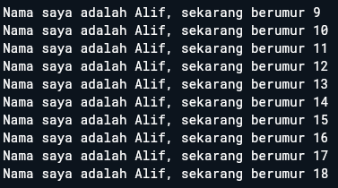
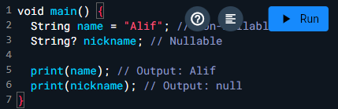
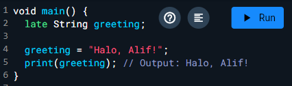

# Pengantar Bahasa Pemrograman Dart - Bagian 1

## Soal 1

output yang diminta  

## Soal 2

Mengapa sangat penting untuk memahami bahasa pemrograman Dart sebelum kita menggunakan framework Flutter ? Jelaskan!

Flutter menggunakan Dart sebagai bahasa utama untuk menulis logika aplikasi, UI, dan interaksi pengguna.

## Soal 3

Rangkumlah materi dari codelab ini menjadi poin-poin penting yang dapat Anda gunakan untuk membantu proses pengembangan aplikasi mobile menggunakan framework Flutter.

Fondasi Bahasa Dart untuk Flutter

- Dart adalah bahasa utama Flutter: Semua kode Flutter ditulis dalam Dart, mulai dari UI hingga logika bisnis.
- Sintaks Dart mirip bahasa modern: Mudah dipahami bagi yang sudah familiar dengan JavaScript, Java, atau C#.

Cara Kerja Dart

- Kompilasi Ganda: Dart mendukung Just-In-Time (JIT) untuk pengembangan cepat dan Ahead-Of-Time (AOT) untuk performa tinggi saat rilis.
- Garbage Collection: Manajemen memori otomatis, penting untuk aplikasi mobile yang efisien.

Fitur Bahasa yang Mendukung Flutter

- Null Safety: Mencegah error akibat nilai null yang tidak terduga.
- Late Variables: Menunda inisialisasi variabel hingga dibutuhkan, berguna dalam pengaturan state.
- Type System: Mendukung penulisan kode yang aman dan terstruktur.

Praktik dan Struktur Bahasa

- Class dan Object-Oriented Programming: Memudahkan pengelolaan komponen UI dan logika aplikasi.
- Function dan Parameter: Digunakan untuk event handling dan pemrosesan data.
- Control Flow (if, for, while): Mengatur alur logika aplikasi.

## Soal 4

Buatlah penjelasan dan contoh eksekusi kode tentang perbedaan Null Safety dan Late variabel !

Null Safety
adalah fitur Dart yang mencegah variabel memiliki nilai null secara tidak sengaja. Ini membantu menghindari error seperti NullPointerException.

- Non-nullable: Variabel harus diinisialisasi dengan nilai bukan null.
  Nullable: Ditandai dengan tanda ?, variabel boleh bernilai null

contoh kode  

Late Variabel
digunakan untuk menunda inisialisasi variabel non-nullable sampai nanti, tapi tetap menjamin bahwa variabel akan diisi sebelum digunakan.

Contoh kode  

