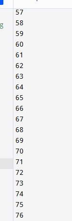

# Pengantar Bahasa Pemrograman Dart - 2

## Praktikum 1: Menerapkan Control Flows ("if/else")

Perbaikan kode  

Output  

Variabel test bernilai "test2". Kondisi pertama if (test == "test1") bernilai false, jadi lanjut ke else if (est == "test2"), yang bernilai true kemudian mencetak "test2".  
Kondisi kedua if (test == "test2") juga bernilai true → mencetak "Test2 again".

## Praktikum 2: Menerapkan Perulangan "while" dan "do-while"

Perbaikan kode  

Output  

pada contoh praktikum, variabel counter belum dideklarasikan, maka ketika run akan muncul error: "Undefined name 'counter'". setelah ditambahkan deklarasi awal, kode tersebut akan menetak nilai counter dari awal hingga kurang dari 33. disini saya set nilai dari variabel counter adalah 30.

Perbaikan kode  

Output  

Perulangan do-while akan emngeksekusi blok kode terlebih dahulu, lalu mengecek kondisi. Jika counter sudah mencapai 33 dari perulangan sebelumnya, maka perulangan ini akan melanjutkan dari 33 hingga 76.

## Praktikum 3: Menerapkan Perulangan "for" dan "break-continue"

Perbaikan kode  

Output  

Pada contoh kode, penulisan Index dan index tidak konsisten. Tidak ada deklarasi tipe data untuk index.
