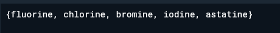

# Pengantar Bahasa Pemrograman Dart - Bagian 3   Collections, Records, dan Functions di Dart

## Praktikum 1: Eksperimen Tipe Data List

### Salin kode dari jobsheet

#### Kode Program

#### Output

#### Penjelasan

Program membuat list dengan 3 elemen '[1,2,3]'. Assert digunakan untuk memastikan nilai tertentu benar saat runtime. Setelah '[list]' diubah menjadi 1, maka isi list menjadi '[1,1,3]'. Semua 'print' menampilkan nilai sesuai perubahan.
Catatan: Tidak ada eror karena semua operasi valid untuk list bertipe 'int'

### Ubah menjadi 'final' list dengan 5 elemen dan isi nama/NIM

#### Kode program

#### Output

#### Penjelasan

menggunakan 'list<dynamic>' agar dapat menampung tipe data campuran (string dan null).

## Praktikum 2: Eksperimen Tipe Data Set

### Salin kode ke dalam fungsi main()

#### Kode program

#### Output

#### Penjelasan

Kode ini membuat sebuah 'set' berisi string nama nama unsur halogen. 'set' adalah koleksi yang tidak engizinkan duplikasi dan tidak menjamin urutan elemen. Output menampilkan isi dari variabel halogens.

### Penambahan kode

#### Kode program

#### Output

#### Penjelasan

## Praktikum 3: Eksperimen Tipe Data Maps

### Langkah 1

#### Kode Program

#### Output

### Penjelasan

Tipe data maps menggunakan key value untuk mengidentifikasi variabel nya.

### Langkah 2: Modifikasi kode menambahkan Nama dan NIM

#### Kode Program

#### Output

## Praktikum 4: Eksperimen Tipe Data List: Spread dan Control-flow Operators

### Langkah 1

#### Kode Program

#### Output

### Langkah 2

#### Kode Program

#### Output

Menambahkan NIM pada kode program

#### Kode Program

#### Output

### Langkah 3

# ### Kode Program

#### Output

### Langkah 4

#### Kode program

#### Output

### Langkah 5

#### Kode Program

#### Output

