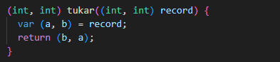
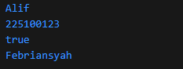

# Pengantar Bahasa Pemrograman Dart - Bagian 3   Collections, Records, dan Functions di Dart

## Praktikum 1: Eksperimen Tipe Data List

### Salin kode dari jobsheet

#### Kode Program

#### Output

#### Penjelasan

Program membuat list dengan 3 elemen '[1,2,3]'. Assert digunakan untuk memastikan nilai tertentu benar saat runtime. Setelah '[list]' diubah menjadi 1, maka isi list menjadi '[1,1,3]'. Semua 'print' menampilkan nilai sesuai perubahan.
Catatan: Tidak ada eror karena semua operasi valid untuk list bertipe 'int'

### Ubah menjadi 'final' list dengan 5 elemen dan isi nama/NIM

#### Kode program

#### Output

#### Penjelasan

menggunakan 'list<dynamic>' agar dapat menampung tipe data campuran (string dan null).

## Praktikum 2: Eksperimen Tipe Data Set

### Salin kode ke dalam fungsi main()

#### Kode program

#### Output

#### Penjelasan

Kode ini membuat sebuah 'set' berisi string nama nama unsur halogen. 'set' adalah koleksi yang tidak engizinkan duplikasi dan tidak menjamin urutan elemen. Output menampilkan isi dari variabel halogens.

### Penambahan kode

#### Kode program

#### Output

#### Penjelasan

## Praktikum 3: Eksperimen Tipe Data Maps

### Langkah 1

#### Kode Program

#### Output

### Penjelasan

Tipe data maps menggunakan key value untuk mengidentifikasi variabel nya.

### Langkah 2: Modifikasi kode menambahkan Nama dan NIM

#### Kode Program

#### Output

## Praktikum 4: Eksperimen Tipe Data List: Spread dan Control-flow Operators

### Langkah 1

#### Kode Program

#### Output

### Langkah 2

#### Kode Program

#### Output

Menambahkan NIM pada kode program

#### Kode Program

#### Output

### Langkah 3

# ### Kode Program

#### Output

### Langkah 4

#### Kode program

#### Output

### Langkah 5

#### Kode Program

#### Output

## Praktikum 5: Eksperimen Tipe Data Records

### Langkah 1

#### Kode Program

#### Output

### Langkah 2

#### Kode Program

#### output

### Langkah 3

#### Kode Program

#### Output

### Langkah 4

#### Kode Program

#### Ouput

## Tugas Praktikum

2. Jelaskan yang dimaksud Functions dalam bahasa Dart!  
   🔹 Functions adalah blok kode yang dapat dipanggil untuk menjalankan tugas tertentu. Fungsinya mirip seperti “resep” yang bisa digunakan berulang kali. Dalam Dart, function bisa menerima parameter dan mengembalikan nilai.

3. Jelaskan jenis-jenis parameter di Functions beserta contoh sintaksnya!
   Dart mendukung beberapa jenis parameter:

Positional Parameter: Parameter berdasarkan urutan.

dart

void greet(String name) {
print('Hello $name');
}

Optional Positional Parameter: Parameter yang bisa tidak diisi.

dart

void greet([String? name]) {
print('Hello $name');
}

Named Parameter: Parameter yang disebutkan dengan nama.

dart

void greet({String? name}) {
print('Hello $name');
}

Required Named Parameter: Named parameter yang wajib diisi.

dart

void greet({required String name}) {
print('Hello $name');
}

4. Jelaskan maksud Functions sebagai first-class objects beserta contoh sintaknya!
   Functions sebagai first-class objects berarti fungsi dapat:

- Disimpan dalam variabel
- Dikirim sebagai parameter
- Dikembalikan dari fungsi lain

Contoh:

dart

void sayHello() {
print('Hello!');
}

void execute(Function f) {
f();
}

void main() {
var greet = sayHello;
execute(greet); // Output: Hello!
}

5. Apa itu Anonymous Functions? Jelaskan dan berikan contohnya!
   Anonymous Functions adalah fungsi tanpa nama, biasanya digunakan sebagai parameter atau callback.

Contoh:

dart

var numbers = [1, 2, 3];
numbers.forEach((num) {
print(num \* 2);
});

6. Jelaskan perbedaan Lexical scope dan Lexical closures! Berikan contohnya!

Lexical Scope: Variabel hanya bisa diakses dalam blok tempat ia didefinisikan.

dart
void main() {
int x = 10;
void printX() {
print(x); // Bisa akses x karena dalam scope
}
printX();
}

Lexical Closure: Fungsi bisa “mengingat” variabel dari scope luar meski scope itu sudah selesai.

dart

Function counter() {
int count = 0;
return () {
count++;
print(count);
};
}

void main() {
var increment = counter();
increment(); // Output: 1
increment(); // Output: 2
}

7. Jelaskan dengan contoh cara membuat return multiple value di Functions!

Dart tidak mendukung return multiple values secara langsung, tapi bisa menggunakan Record atau Map.

Contoh dengan Record (Dart 3):

dart

(String, int) getUser() {
return ('Alif', 225100123);
}

void main() {
var (name, nim) = getUser();
print('Nama: $name, NIM: $nim');
}

Contoh dengan Map:

dart

Map<String, dynamic> getUser() {
return {'name': 'Alif', 'nim': 2341720025};
}
