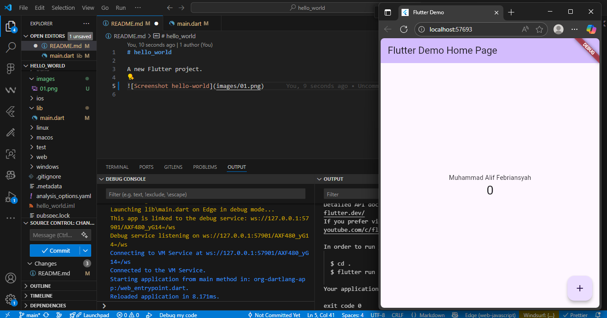
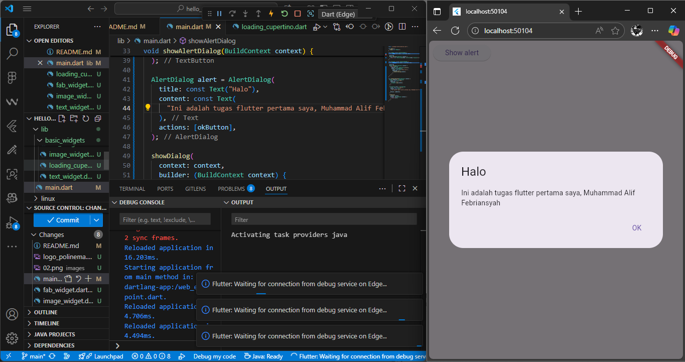

# hello_world

A new Flutter project.

#### Penjelasan

Menampilkan tombol dam loading bar ala ios

#### Penjelasan

Floating action button dengan aksi snackbar

#### Penjelasan

Struktur dasar aplikasi dengan AppBar, FAB, dan BottomAppbar

#### Penjelasan

Menampilkan dialog alert dengan tombol OK

#### Penjelasan

Input teks dengan label dan border

#### Penjelasan

Memilih tanggal dan menampilkannya di layar
