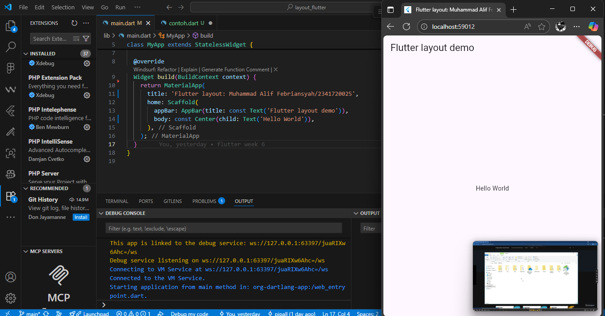
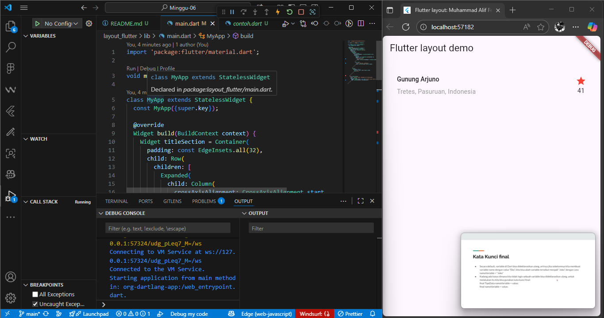
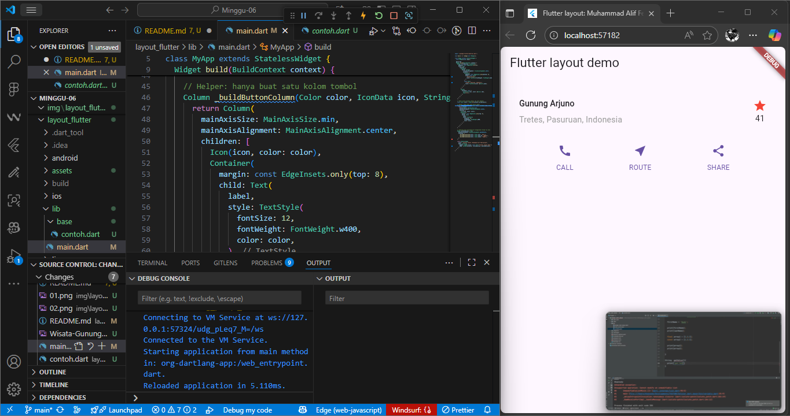
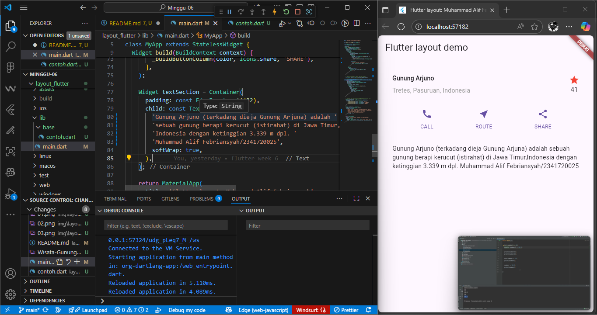
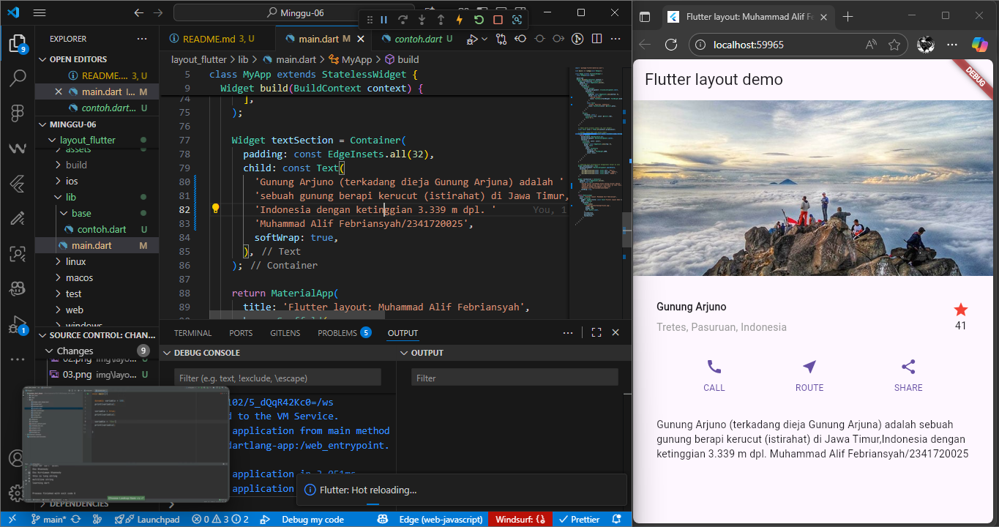

# Project layout_flutter

## Praktikum 1: Membangun Layout Flutter

### Penjelasan

Hasil output kode ini hanya akan menampilkan hello world pada tampilan di edge

### Penjelasan

Menampilkan informasi tempat wisata berupa nama, lokasi, ikon bintang, dan angka rating.

## Praktikum 2: Implementasi button row

### Penjelasan

method '\_buildButtonColumn()' bertugas membangun satu kolom tombol. Memiliki parameter warna, ikon dan label teks. Widget 'buttonSection' menggunakan 'Row' untuk menyusun tiga kolom tombol secara horizontal. Masing-masing kolom dibuat dengan '\_buildButtonColumn()' dan mengisi parameter sesuai kebutuhan. 'MainAxisAlignement.spaceEvenly' digunakan agar jarak antar kolom merata.

## Praktikum 3: Implementasi text section

### Penjelasan

Text dimasukkan ke dalam 'Container' agar bisa diberi padding di semua sisi. 'EdgeInsets.all(32)' memberi ruang piksel disekelilng teks agar tidak menempel di tepi layar. 'softWrap: true' memastikan teks membungkud secara otomatis saat mencapai batas layar, sehingga tidak terpotong.

## Praktikum 4: Implementasi image section

### Penjelasan

Gambar ditambahkan ke dalam 'body' menggunakan widget 'Image.set'. Properti 'BoxFit.cover' digunakan agar gambar memenuhi ruang yang tersedia tanpa distorsi. Layout yang awalnya 'column' diubah menjadi 'lastView' agar tampilan bisa di scroll saat layar perangkat terlalu kecil untuk menampilkan semua sekaligus.
