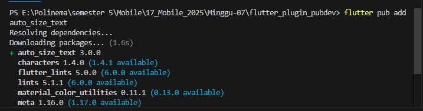
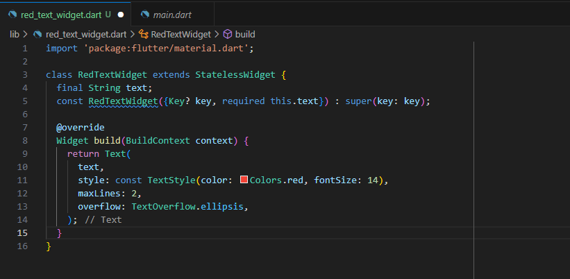
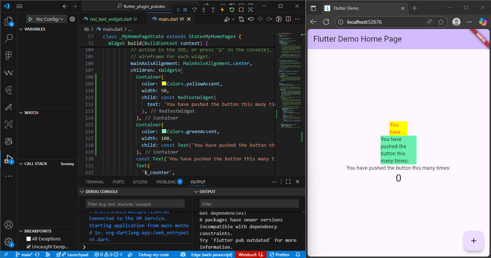

# Praktikum

### Penjelasan

auto_size_text adalah plugin tambahan ke dalam project flutter. dengan perintah flutter pub add auto_size_text, kita menambahkan dependensi ke file pubspec.yaml, yang artinya Flutter akan mengunduh dan mengintegrasikan plugin tersebut saat build.

### Penjelasan

Error muncul karena AutoTextSize membutuhkan text, tapi variabel text belum didefinisikan. Dengan menambahkan final string text; dan required this.text di contructor, kamu membuat widget menjadi reusable dan fleksibel.

### Penjelasan

Menambahkan ResTextWidget kek dalam layout aplikasi agar bisa diuji langsung. Perbandingan antara RedTextWidget dan Text biasa menunjukkan efek dari plugin auto_size_text, terutama dalam penyesuaian ukuran otomatis.
