## 🧩 Langkah-langkah Praktikum 1

- Langkah 1: Buat Project Baru
  📄 File: main.dart

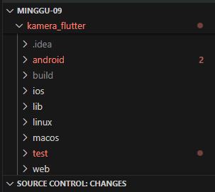

Buat project Flutter baru dengan nama kamera_flutter.

Tujuan: Menyiapkan struktur awal aplikasi Flutter.

- Langkah 2: Tambah Dependensi
  📄 File: pubspec.yaml

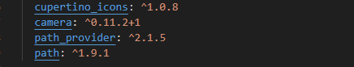

Plugin yang ditambahkan:

yaml
dependencies:
camera: ^0.10.5+2
path_provider: ^2.1.1
path: ^1.8.3
Tujuan:

camera: mengakses kamera perangkat.

path_provider: menentukan lokasi penyimpanan file.

path: mengelola path file lintas platform.

- Langkah 3: Ambil Sensor Kamera dari Device
  📄 File: main.dart

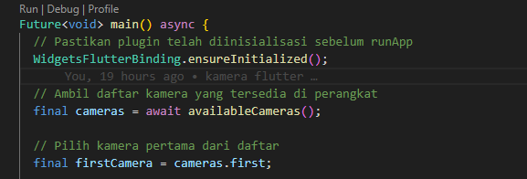

Tujuan:

Menginisialisasi plugin sebelum runApp().

Mengambil daftar kamera yang tersedia.

Memilih kamera pertama (biasanya kamera belakang).

- Langkah 4: Buat dan Inisialisasi CameraController
  📄 File: lib/widget/takepicture_screen.dart

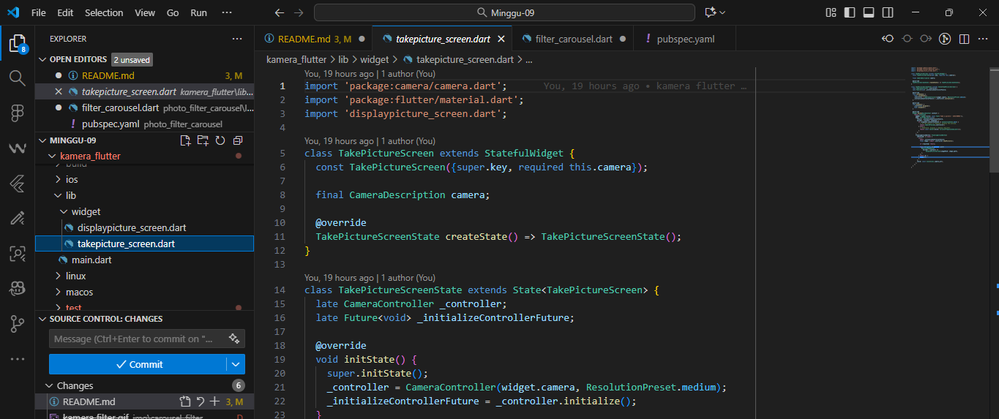

Tujuan:

Membuat CameraController untuk mengatur kamera.

Menginisialisasi controller saat widget dimuat.

Membersihkan controller saat widget dihancurkan.

🔹 Langkah 5: Gunakan CameraPreview
📄 File: lib/widget/takepicture_screen.dart

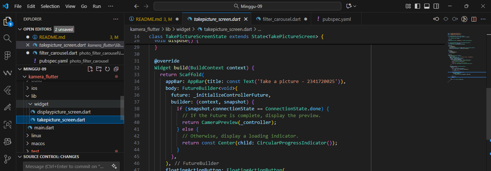

Tujuan:

Menampilkan pratinjau kamera setelah controller selesai diinisialisasi.

Menunggu proses async dengan FutureBuilder.

- Langkah 6: Ambil Foto dengan CameraController
  📄 File: lib/widget/takepicture_screen.dart

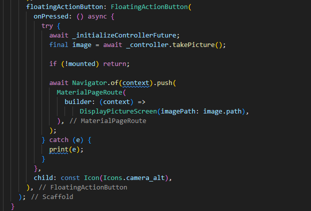

Tujuan:

Mengambil foto saat tombol ditekan.

Menangani error dengan try/catch.

- Langkah 7: Buat Widget DisplayPictureScreen
  📄 File: lib/widget/displaypicture_screen.dart

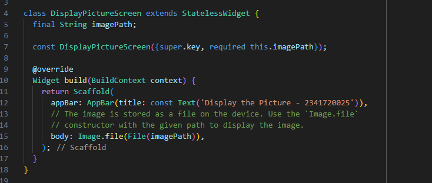

Tujuan:

Menampilkan hasil foto yang diambil.

Menerima path gambar dari halaman sebelumnya.

- Langkah 8: Edit main.dart
  📄 File: main.dart

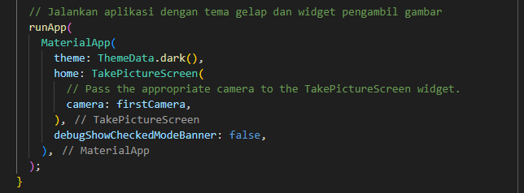

Tujuan:

Menjalankan aplikasi dengan tema gelap.

Menampilkan halaman TakePictureScreen.

- Langkah 9: Navigasi ke DisplayPictureScreen
  📄 File: lib/widget/takepicture_screen.dart

Kode tambahan:
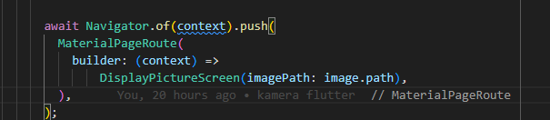

Tujuan:

Setelah foto diambil, tampilkan halaman baru untuk melihat hasilnya.

## 🧩 Langkah-langkah Praktikum 2

- Langkah 1: Buat Project Baru
  Perintah:

Buat project Flutter baru dengan nama photo_filter_carousel.

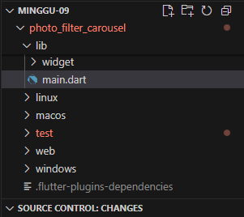

Tujuan: Menyiapkan struktur awal aplikasi Flutter.

- Langkah 2: Buat Widget Selector Ring dan Shadow Gradient
  📄 File: lib/widget/filter_selector.dart

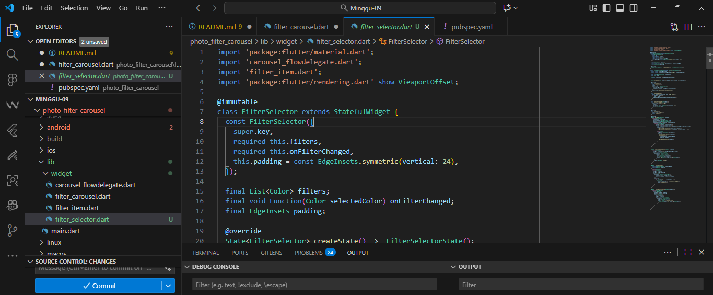

Penjelasan: Widget ini menampilkan carousel filter warna yang bisa digeser. Saat pengguna memilih filter, warna akan diterapkan ke foto.

Komponen penting:

PageController: mengatur scroll horizontal.

\_onPageChanged(): mendeteksi perubahan halaman dan menerapkan warna filter.

\_buildCarousel(): menampilkan daftar warna sebagai carousel.

\_buildSelectionRing(): menampilkan lingkaran putih sebagai indikator filter aktif.

\_buildShadowGradient(): menambahkan efek gradasi gelap di bawah carousel.

- Langkah 3: Buat Widget Photo Filter Carousel
  📄 File: lib/widget/filter_carousel.dart

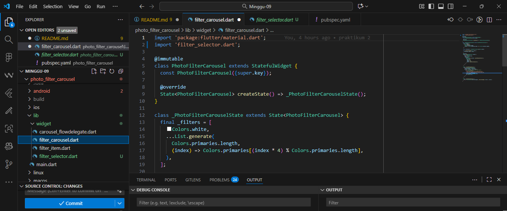

Penjelasan: Widget utama yang menampilkan foto dan carousel filter di bagian bawah.

Komponen penting:

\_filters: daftar warna filter.

\_filterColor: ValueNotifier untuk menyimpan warna filter aktif.

\_buildPhotoWithFilter(): menampilkan foto dengan efek warna.

\_buildFilterSelector(): memanggil FilterSelector dari langkah sebelumnya.

Catatan: Foto diambil dari URL dan diberi efek warna menggunakan colorBlendMode.

- Langkah 4: Buat Filter Warna – Bagian 1
  📄 File: lib/widget/carousel_flowdelegate.dart

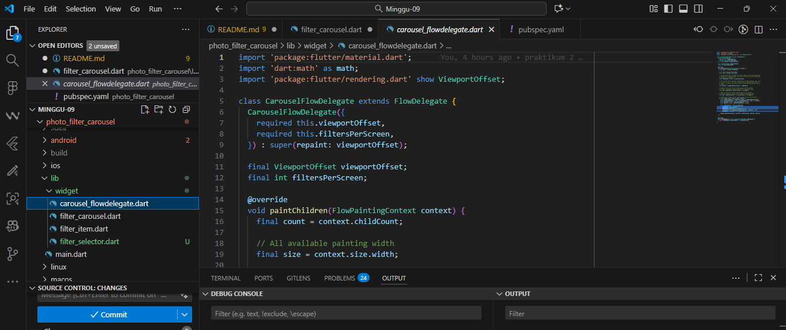

Penjelasan: Custom FlowDelegate untuk mengatur animasi dan posisi item dalam carousel.

Komponen penting:

paintChildren(): menghitung posisi, skala, dan transparansi setiap item berdasarkan posisi scroll.

Matrix4: digunakan untuk transformasi visual (skala dan translasi).

viewportOffset: digunakan untuk mengetahui posisi scroll saat ini.

- Langkah 5: Buat Widget Filter Item
  📄 File: lib/widget/filter_item.dart

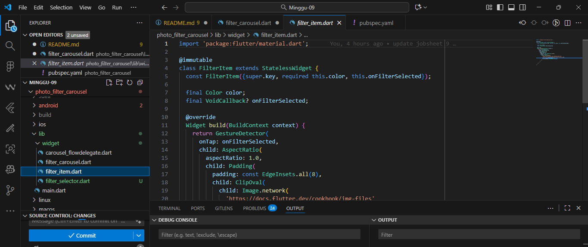

Penjelasan: Widget individual untuk setiap warna filter dalam carousel.

Komponen penting:

GestureDetector: mendeteksi tap pada filter.

ClipOval: membuat bentuk bulat.

Image.network: menampilkan tekstur dengan warna filter.

- Langkah 6: Implementasi ke main.dart
  📄 File: lib/main.dart

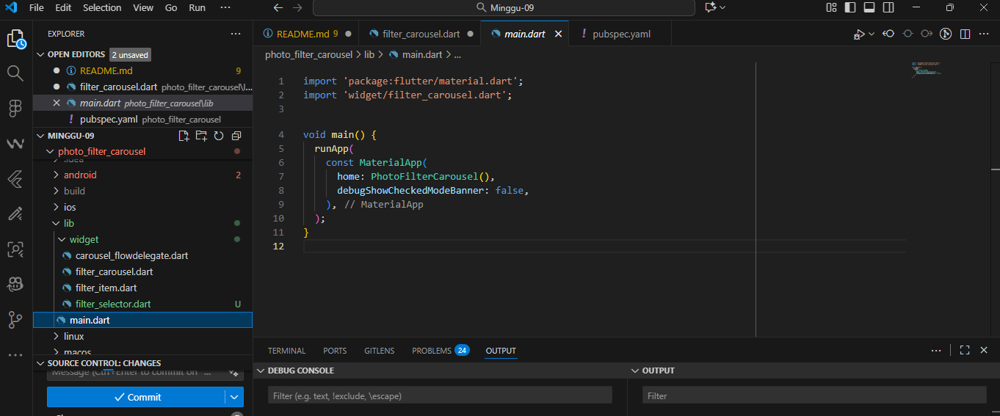

Penjelasan: Menjalankan aplikasi dan menampilkan PhotoFilterCarousel sebagai halaman utama.

Kode:

## Jawaban Soal

### Nomor 3: Jelaskan maksud void async pada praktikum 1

void async digunakan untuk mendefinisikan fungsi asynchronous, yaitu fungsi yang dapat menjalankan proses secara tidak langsung (tidak blocking). Dalam konteks Flutter:

void menunjukkan bahwa fungsi tidak mengembalikan nilai.

async memungkinkan penggunaan await di dalam fungsi tersebut, agar bisa menunggu hasil dari operasi asynchronous seperti pengambilan foto dari kamera.

Contoh:

dart
void ambilFoto() async {
final foto = await ImagePicker().pickImage(source: ImageSource.camera);
// proses lanjutan setelah foto diambil
}
Tanpa async, kita tidak bisa menggunakan await, dan proses pengambilan foto bisa menyebabkan UI freeze karena menunggu hasil secara langsung.

### Nomor 4: Jelaskan fungsi dari anotasi @immutable dan @override

@immutable:

Digunakan untuk menandai bahwa sebuah class tidak boleh diubah setelah dibuat.

Biasanya digunakan pada Widget di Flutter agar nilai properti tidak berubah, menjaga konsistensi dan efisiensi rendering.

Contoh:

dart
@immutable
class MyWidget extends StatelessWidget {
final String title;
const MyWidget({required this.title});
}
@override:

Digunakan untuk menandai bahwa sebuah method atau properti sedang menimpa (override) method dari superclass.

Membantu compiler dan pembaca kode memahami bahwa kita sengaja mengganti perilaku bawaan.

Contoh:

dart
@override
Widget build(BuildContext context) {
return Text('Halo');
}

## Tugas gabungan praktim 1 dan 2

[img](img/carousel_filter/kamera_filter.gif)

📄 File: lib/main.dart
[img](img/carousel_filter/01.png)

Penjelasan:

availableCameras() → memuat semua kamera di perangkat (biasanya depan dan belakang).

MyApp → aplikasi utama dengan halaman pertama CameraWithFilterPage.

runApp() → menjalankan aplikasi setelah kamera siap.

Kelebihan desain ini: main.dart tetap bersih dan sesuai standar Flutter — hanya inisialisasi & navigasi awal.

📄 File: lib/main.dart
[img](img/carousel_filter/02.png)

Penjelasan:

Filter diterapkan real-time dengan ColorFiltered.

PageView digunakan untuk memilih filter secara horizontal (seperti carousel).

FilterIndicator menunjukkan huruf awal filter di tengah tombol jepret.

Nama filter aktif ditampilkan di bawah tombol kamera.

PreviewPage menampilkan hasil foto dengan filter yang sama.

Tidak menyimpan ke galeri — hanya menampilkan hasil di aplikasi.

📄 File: lib/main.dart
[img](img/carousel_filter/03.png)

Penjelasan

label.substring(0, 1) → mengambil huruf pertama dari nama filter.

Diposisikan di tengah tombol jepret agar intuitif dan estetik.

Ukuran besar agar mudah terlihat di layar kamera.
