# 10 | Dasar State Management

## 🧠 Tujuan Praktikum 1

Membangun aplikasi to-do sederhana dengan struktur data yang rapi dan pemisahan antara model (data) dan view (UI). Ini melatihmu memahami bagaimana state (keadaan aplikasi) dikelola dan diubah.

## 🔍 Penjelasan Setiap Langkah dan Kode Praktikum 1

### Langkah 1: Buat Project Baru

bash
flutter create master_plan
Membuat project Flutter bernama master_plan.

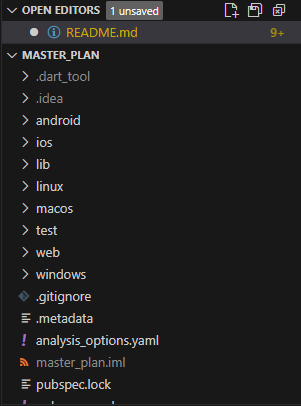

Disimpan di folder src/week-10 sesuai struktur laporan.

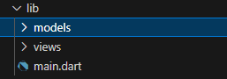

### Langkah 2: Membuat model task.dart

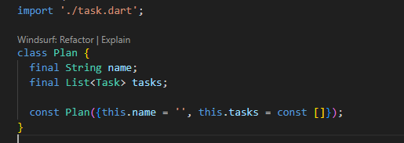

Tujuan: Representasi satu tugas.

description: Deskripsi tugas.

complete: Status selesai atau belum.

const: Menandakan objek immutable (tidak bisa diubah setelah dibuat).

### Langkah 3: Buat file plan.dart

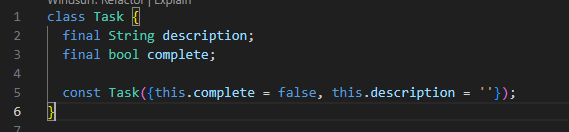

Tujuan: Menyimpan daftar tugas dalam satu rencana.

name: Nama rencana.

tasks: List dari objek Task.

### Langkah 4: Buat file data_layer.dart

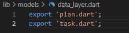

Tujuan: Mempermudah impor model dengan satu file ekspor.

Praktik modularisasi agar kode lebih rapi.

### Langkah 5: Ubah main.dart

Tujuan: Menjalankan aplikasi dengan tampilan awal PlanScreen.

primarySwatch: Warna tema utama.

StatelessWidget: Tidak memiliki state internal.

### Langkah 6: Buat plan_screen.dart

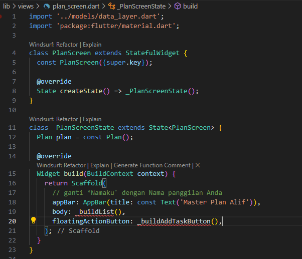

Tujuan: Menampilkan UI utama.

StatefulWidget: Karena state akan berubah (menambah tugas).

Scaffold: Struktur dasar UI Flutter.

### Langkah 7: Method \_buildAddTaskButton()

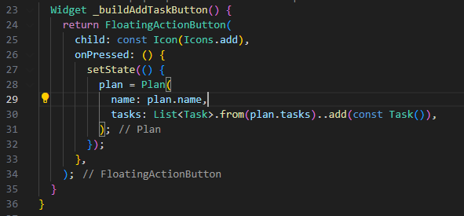

Tujuan: Menambah tugas baru ke dalam list.

setState: Memicu rebuild UI.

..add(...): Menambahkan item ke list.

### Langkah 8: Widget \_buildList()

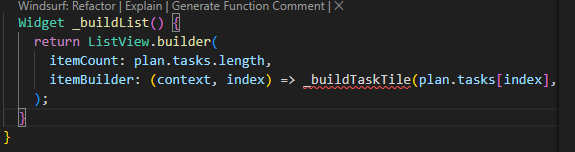

Tujuan: Menampilkan semua tugas dalam bentuk scrollable list.

ListView.builder: Efisien untuk list dinamis.

### Langkah 9: Widget \_buildTaskTile()

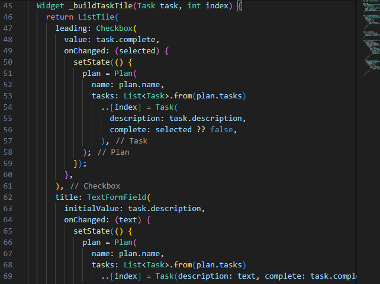

Tujuan: Menampilkan satu tugas dengan checkbox dan input teks.

Checkbox: Menandai selesai/tidak.

TextFormField: Mengubah deskripsi tugas.

### Langkah 10–13: Scroll Controller

Langkah 10: Tambah variabel ScrollController.

Langkah 11: Tambah listener untuk menghapus fokus saat scroll.

Langkah 12: Tambah controller dan behavior ke ListView.

Langkah 13: Tambah dispose() untuk membersihkan controller.

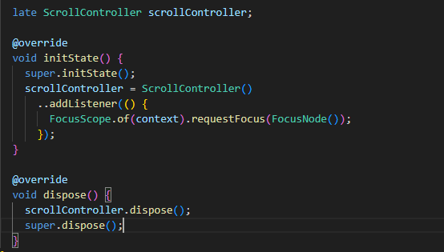

Langkah 14: Hot Restart
Hot reload: Untuk perubahan UI.

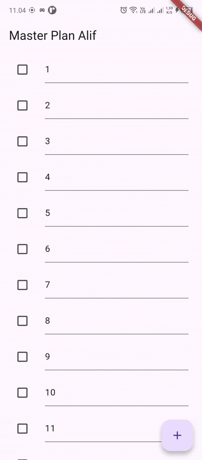

Hot restart: Untuk reset state aplikasi.

## 📃 Tugas Praktikum 1

### 🧩 Soal 2: Jelaskan maksud dari langkah 4 pada praktikum tersebut!

Langkah 4 membuat file data_layer.dart yang berisi:

dart
export 'plan.dart';
export 'task.dart';

Penjelasan: Langkah ini bertujuan untuk menyederhanakan proses impor model ke file lain. Dengan menggunakan export, kita bisa mengakses Plan dan Task cukup dengan mengimpor data_layer.dart. Ini adalah praktik modularisasi yang membuat struktur proyek lebih rapi dan maintainable, karena semua model dikumpulkan dalam satu pintu masuk.

### 🧩 Soal 3: Mengapa dilakukan demikian?

Penjelasan: Tujuannya adalah untuk memisahkan antara data (model) dan tampilan (UI). Dengan memisahkan model ke dalam file tersendiri, kita menerapkan prinsip separation of concerns. Ini memudahkan pengembangan, debugging, dan perawatan kode karena setiap bagian memiliki tanggung jawab yang jelas.

### 🧩 Soal 4: Mengapa perlu variabel plan di langkah 6 pada praktikum tersebut?

Penjelasan: Variabel plan digunakan untuk menyimpan state utama aplikasi, yaitu daftar tugas dan nama rencana. Karena aplikasi ini bersifat dinamis (bisa menambah dan mengubah tugas), kita butuh variabel yang bisa diubah dan direbuild. Dengan menjadikannya bagian dari State, kita bisa memodifikasi plan menggunakan setState() agar UI ikut diperbarui.

### 🧩 Soal 5: Mengapa dibuat konstanta?

Penjelasan: Konstanta (const) digunakan untuk membuat objek yang immutable (tidak bisa diubah setelah dibuat). Ini meningkatkan efisiensi karena Flutter bisa mengoptimalkan widget yang tidak berubah. Dalam konteks model Task dan Plan, penggunaan const membantu menjaga stabilitas data dan mencegah perubahan tak disengaja.

## 🧠 Tujuan Praktikum 2

Mengelola state aplikasi dengan pendekatan yang lebih baik.

Menggunakan InheritedNotifier untuk menyebarkan data ke seluruh widget tree.

Memisahkan data dari UI agar lebih modular dan scalable.

## 🔍 Penjelasan Setiap Langkah dan Kode Praktikum 2

### Langkah 1: Buat file plan_provider.dart

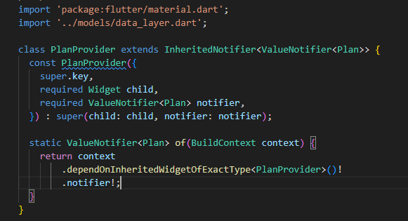

Penjelasan:

PlanProvider adalah pembungkus data Plan yang bisa diakses oleh seluruh widget di bawahnya.

Menggunakan InheritedNotifier agar perubahan data otomatis memicu rebuild pada widget yang bergantung padanya.

of(context) adalah helper method untuk mengambil data Plan dari context mana pun.

### Langkah 2: Edit main.dart

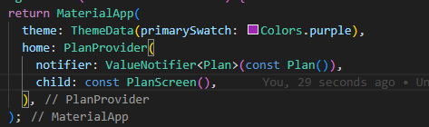

Penjelasan:

Membungkus PlanScreen dengan PlanProvider.

ValueNotifier<Plan> digunakan agar data bisa berubah dan memberi tahu widget yang mendengarkan.

PlanProvider menyebarkan data Plan ke seluruh subtree.

### Langkah 3: Tambah method di plan.dart

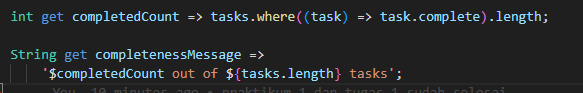

Penjelasan:

completedCount: Menghitung jumlah tugas yang sudah selesai.

completenessMessage: Menyusun pesan ringkasan progres tugas.

Ini akan digunakan untuk menampilkan progres di UI.

### Langkah 4: Edit PlanScreen

Hapus variabel plan lokal.

Semua data sekarang diakses melalui PlanProvider.of(context).

Penjelasan:

Ini memastikan bahwa data tidak lagi disimpan secara lokal di State, tapi diakses dari Provider.

Menjaga konsistensi dan memudahkan pengelolaan state.

### Langkah 5: Edit \_buildAddTaskButton()

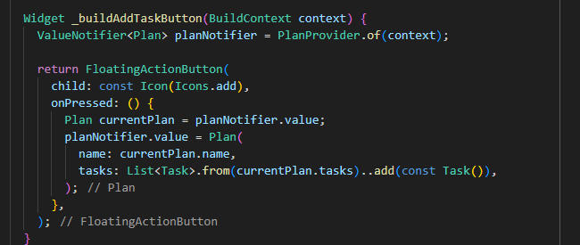

Penjelasan:

Mengambil planNotifier dari context.

Menambahkan tugas baru ke dalam list dengan cara membuat salinan list lama dan menambahkan Task() baru.

### Langkah 6: Edit \_buildTaskTile()

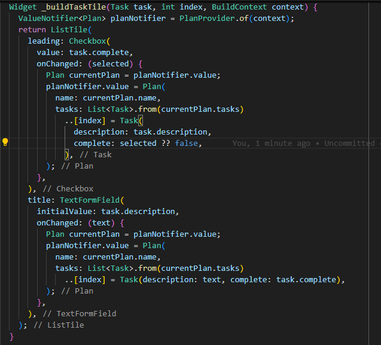

Penjelasan:

Checkbox dan TextFormField kini mengakses dan memodifikasi data melalui planNotifier.

Menggunakan salinan list agar tetap immutable dan memicu rebuild.

Langkah 7: Edit \_buildList()
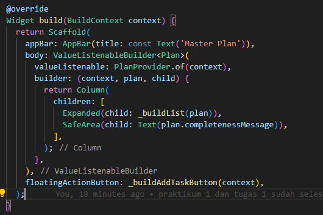

Penjelasan:

Menambahkan parameter Plan agar bisa digunakan untuk membangun list tugas.

Tetap menggunakan scrollController untuk UX yang lebih baik.

Langkah 8–9: Tambah SafeArea dan tampilkan progres
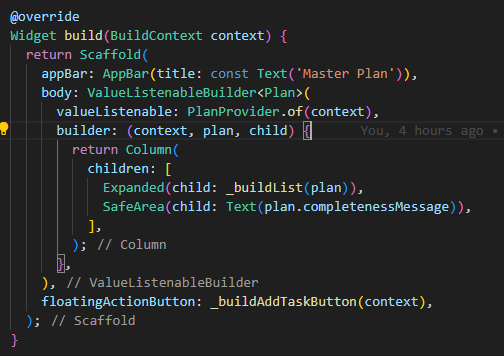

Penjelasan:

ValueListenableBuilder digunakan untuk mendengarkan perubahan pada Plan.

Expanded membungkus list agar tidak menabrak teks progres.

SafeArea memastikan teks progres tidak tertutup oleh notch atau tombol navigasi.

### 🧩 Kesimpulan Praktikum 2

Kamu telah memisahkan data dari UI dengan InheritedNotifier.

Ini adalah langkah awal menuju arsitektur yang lebih scalable seperti Provider, Riverpod, atau Bloc.

Praktikum ini memperkenalkan konsep reactive state management yang efisien dan terstruktur.

## 📃 Tugas Praktikum 2

### 🧩 Soal 2: Jelaskan mana yang dimaksud InheritedWidget pada langkah 1 tersebut! Mengapa yang digunakan InheritedNotifier?

Jawaban:

Pada langkah 1, kita membuat class PlanProvider yang merupakan turunan dari InheritedNotifier<ValueNotifier<Plan>>. Di sinilah letak penggunaan InheritedWidget, yaitu melalui InheritedNotifier sebagai bentuk khusus dari InheritedWidget.

Yang dimaksud InheritedWidget adalah PlanProvider itu sendiri, karena ia mewarisi InheritedNotifier, yang merupakan subclass dari InheritedWidget.

Mengapa digunakan InheritedNotifier? Karena InheritedNotifier memungkinkan kita:

Menyebarkan data (Plan) ke seluruh widget tree tanpa harus meneruskan secara manual.

Memanfaatkan ValueNotifier untuk mendeteksi perubahan data dan otomatis me-rebuild widget yang bergantung padanya.

Mengelola state secara efisien dan terpusat, tanpa perlu setState() di banyak tempat.

Dengan kata lain, InheritedNotifier adalah cara yang lebih terstruktur dan reaktif untuk mengelola state dibanding pendekatan manual.

### 🧩 Soal 3: Jelaskan maksud dari method di langkah 3 pada praktikum tersebut! Mengapa dilakukan demikian?

Jawaban:

Pada langkah 3, kita menambahkan dua method ke dalam model Plan:

dart
int get completedCount => tasks.where((task) => task.complete).length;

String get completenessMessage => '$completedCount out of ${tasks.length} tasks';
Maksud dari method tersebut:

completedCount: Menghitung jumlah tugas yang sudah selesai.

completenessMessage: Menyusun pesan ringkasan progres, seperti “2 out of 5 tasks”.

Mengapa dilakukan demikian? Karena kita ingin menampilkan informasi progres kepada pengguna secara real-time di bagian bawah aplikasi. Dengan menempatkan logika ini di dalam model Plan, kita:

Menjaga agar UI tetap bersih dan tidak tercampur dengan logika data.

Memudahkan akses dan pemakaian informasi progres di berbagai bagian aplikasi.

Menerapkan prinsip encapsulation, yaitu menyimpan logika terkait data di dalam modelnya sendiri.

### 🧩 Soal 4: Jelaskan maksud dari praktikum yang telah Anda buat pada Praktikum 2!

Jawaban:

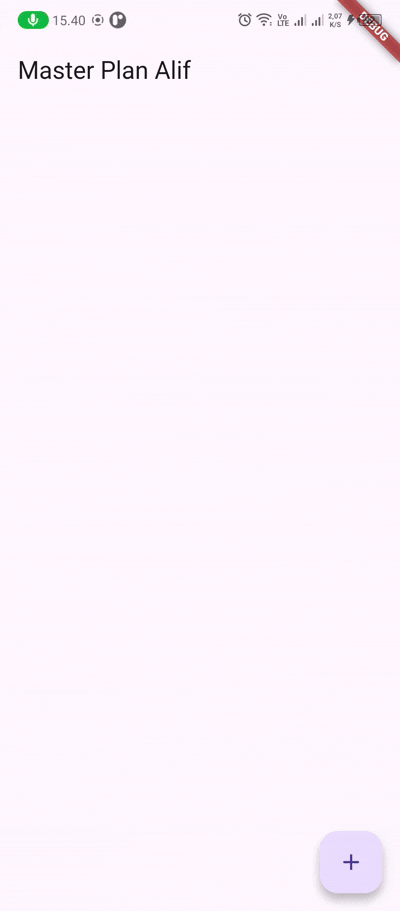

Praktikum 2 bertujuan untuk mengelola state aplikasi Flutter secara lebih terstruktur dan efisien dengan memisahkan data dari tampilan menggunakan pendekatan InheritedNotifier. Dalam praktikum ini, kita membuat sebuah aplikasi to-do list sederhana yang memungkinkan pengguna menambahkan dan mengedit daftar tugas, serta melihat progres penyelesaiannya.

Perbedaan utama dari Praktikum 1 adalah:

State tidak lagi disimpan di dalam StatefulWidget, melainkan dikelola oleh ValueNotifier<Plan> yang dibungkus oleh PlanProvider.

PlanProvider mewarisi InheritedNotifier, yang memungkinkan data Plan disebarkan ke seluruh widget tree dan otomatis memicu rebuild saat data berubah.

Widget seperti Checkbox dan TextFormField tidak lagi memanggil setState(), melainkan memperbarui data melalui planNotifier.value, sehingga lebih terorganisir dan scalable.

Dengan pendekatan ini, kita belajar bagaimana membangun aplikasi Flutter yang lebih modular, maintainable, dan siap untuk dikembangkan lebih lanjut menggunakan arsitektur yang lebih kompleks seperti Provider atau Riverpod.
