# 10 | Dasar State Management

## 🧠 Tujuan Praktikum

Membangun aplikasi to-do sederhana dengan struktur data yang rapi dan pemisahan antara model (data) dan view (UI). Ini melatihmu memahami bagaimana state (keadaan aplikasi) dikelola dan diubah.

## 🔍 Penjelasan Setiap Langkah dan Kode Praktikum 1

### Langkah 1: Buat Project Baru

bash
flutter create master_plan
Membuat project Flutter bernama master_plan.

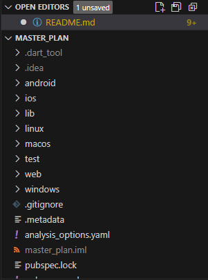

Disimpan di folder src/week-10 sesuai struktur laporan.

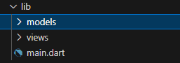

### Langkah 2: Membuat model task.dart

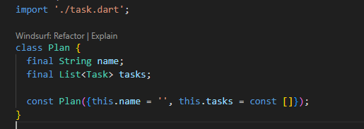

Tujuan: Representasi satu tugas.

description: Deskripsi tugas.

complete: Status selesai atau belum.

const: Menandakan objek immutable (tidak bisa diubah setelah dibuat).

### Langkah 3: Buat file plan.dart

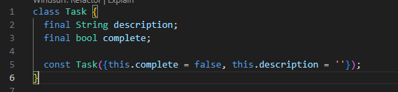

Tujuan: Menyimpan daftar tugas dalam satu rencana.

name: Nama rencana.

tasks: List dari objek Task.

### Langkah 4: Buat file data_layer.dart

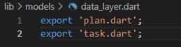

Tujuan: Mempermudah impor model dengan satu file ekspor.

Praktik modularisasi agar kode lebih rapi.

### Langkah 5: Ubah main.dart

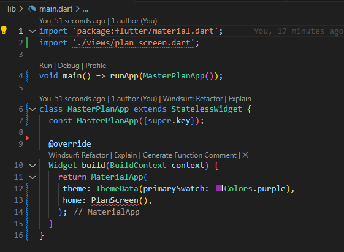

Tujuan: Menjalankan aplikasi dengan tampilan awal PlanScreen.

primarySwatch: Warna tema utama.

StatelessWidget: Tidak memiliki state internal.

### Langkah 6: Buat plan_screen.dart

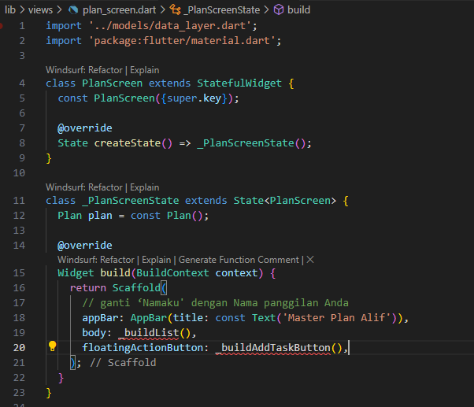

Tujuan: Menampilkan UI utama.

StatefulWidget: Karena state akan berubah (menambah tugas).

Scaffold: Struktur dasar UI Flutter.

### Langkah 7: Method \_buildAddTaskButton()

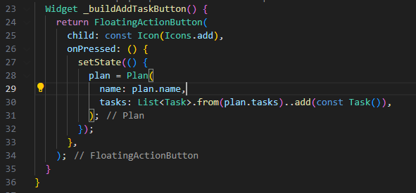

Tujuan: Menambah tugas baru ke dalam list.

setState: Memicu rebuild UI.

..add(...): Menambahkan item ke list.

### Langkah 8: Widget \_buildList()

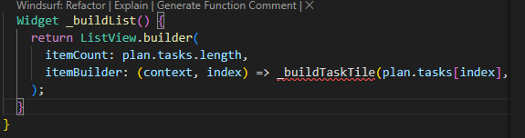

Tujuan: Menampilkan semua tugas dalam bentuk scrollable list.

ListView.builder: Efisien untuk list dinamis.

### Langkah 9: Widget \_buildTaskTile()

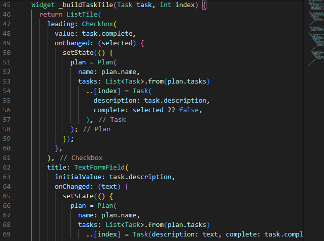

Tujuan: Menampilkan satu tugas dengan checkbox dan input teks.

Checkbox: Menandai selesai/tidak.

TextFormField: Mengubah deskripsi tugas.

### Langkah 10–13: Scroll Controller

Langkah 10: Tambah variabel ScrollController.

Langkah 11: Tambah listener untuk menghapus fokus saat scroll.

Langkah 12: Tambah controller dan behavior ke ListView.

Langkah 13: Tambah dispose() untuk membersihkan controller.

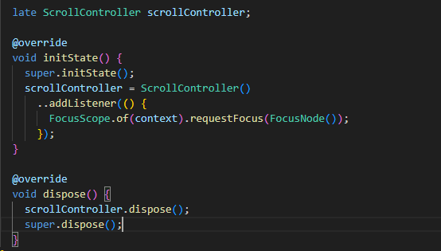

Langkah 14: Hot Restart
Hot reload: Untuk perubahan UI.

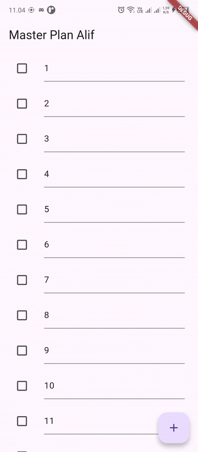

Hot restart: Untuk reset state aplikasi.

## 📃 Tugas Praktikum 1

### 🧩 Soal 2: Jelaskan maksud dari langkah 4 pada praktikum tersebut!

Langkah 4 membuat file data_layer.dart yang berisi:

dart
export 'plan.dart';
export 'task.dart';

Penjelasan: Langkah ini bertujuan untuk menyederhanakan proses impor model ke file lain. Dengan menggunakan export, kita bisa mengakses Plan dan Task cukup dengan mengimpor data_layer.dart. Ini adalah praktik modularisasi yang membuat struktur proyek lebih rapi dan maintainable, karena semua model dikumpulkan dalam satu pintu masuk.

### 🧩 Soal 3: Mengapa dilakukan demikian?

Penjelasan: Tujuannya adalah untuk memisahkan antara data (model) dan tampilan (UI). Dengan memisahkan model ke dalam file tersendiri, kita menerapkan prinsip separation of concerns. Ini memudahkan pengembangan, debugging, dan perawatan kode karena setiap bagian memiliki tanggung jawab yang jelas.

### 🧩 Soal 4: Mengapa perlu variabel plan di langkah 6 pada praktikum tersebut?

Penjelasan: Variabel plan digunakan untuk menyimpan state utama aplikasi, yaitu daftar tugas dan nama rencana. Karena aplikasi ini bersifat dinamis (bisa menambah dan mengubah tugas), kita butuh variabel yang bisa diubah dan direbuild. Dengan menjadikannya bagian dari State, kita bisa memodifikasi plan menggunakan setState() agar UI ikut diperbarui.

### 🧩 Soal 5: Mengapa dibuat konstanta?

Penjelasan: Konstanta (const) digunakan untuk membuat objek yang immutable (tidak bisa diubah setelah dibuat). Ini meningkatkan efisiensi karena Flutter bisa mengoptimalkan widget yang tidak berubah. Dalam konteks model Task dan Plan, penggunaan const membantu menjaga stabilitas data dan mencegah perubahan tak disengaja.
