# 11 | Pemrograman Asynchronus 📱

## Daftar Isi

1. [Praktikum 1: Mengunduh Data dari Web Service (API)](#-praktikum-1-mengunduh-data-dari-web-service-api)
2. [Praktikum 2: Menggunakan await/async](#-praktikum-2-menggunakan-awaitasync-untuk-menghindari-callbacks)
3. [Praktikum 3: Menggunakan Completer di Future](#-praktikum-3-menggunakan-completer-di-future)
4. [Praktikum 4: Memanggil Future Secara Paralel](#-praktikum-4-memanggil-future-secara-paralel)
5. [Praktikum 5: Menangani Respon Error pada Async Code](#-praktikum-5-menangani-respon-error-pada-async-code)
6. [Praktikum 6: Menggunakan Future dengan StatefulWidget](#-praktikum-6-menggunakan-future-dengan-statefulwidget)
7. [Praktikum 7: Manajemen Future dengan FutureBuilder](#-praktikum-7-manajemen-future-dengan-futurebuilder)
8. [Praktikum 8: Navigation Route dengan Future Function](#-praktikum-8-navigation-route-dengan-future-function)
9. [Praktikum 9: Memanfaatkan async/await dengan Widget Dialog](#-praktikum-9-memanfaatkan-asyncawait-dengan-widget-dialog)

---

## 📘 Praktikum 1: Mengunduh Data dari Web Service (API)

### 🎯 Tujuan

Membuat aplikasi Flutter yang mengambil data dari Google Books API secara asynchronous dan menampilkannya di layar.

### 🧱 Langkah-langkah Praktikum

#### Langkah 1: Buat Project Baru

```bash
flutter create books
cd books
flutter pub add http
```


> 📌 **Penjelasan**: Kita membuat project Flutter bernama books, lalu menambahkan dependency http agar bisa melakukan request ke API.

#### Langkah 2: Cek pubspec.yaml


📌 Penjelasan: Pastikan plugin http sudah terpasang. Jika kamu pakai macOS, tambahkan entitlements agar bisa akses jaringan.

#### Langkah 3: Buka dan Tulis main.dart


📌 Penjelasan: Ini adalah struktur dasar aplikasi Flutter. Kita menggunakan MaterialApp dan menambahkan nama panggilan di title sebagai identitas.


#### Langkah 4: Tambahkan Method getData()


📌 Penjelasan: Method ini membuat request ke Google Books API. ✅ Soal 2: Kamu diminta mencari buku favorit di Google Books, lalu ambil ID dari URL dan ganti di path.

#### Langkah 5: Tambahkan Tombol dan Tampilkan Data


### ✅ Jawaban Soal Praktikum

🔸 Soal 1: Tambahkan nama panggilan
Sudah ditambahkan di title: 'Books App - Alif'.


🔸 Soal 2: Ganti ID buku favorit
Sudah diganti dengan ID junbDwAAQBAJ dari buku favorit di Google Books.


🔸 Soal 3: Jelaskan substring dan catchError
substring(0, 450) → digunakan untuk memotong isi response agar hanya menampilkan 450 karakter pertama. Ini berguna agar tampilan tidak terlalu panjang dan tetap rapi.

catchError → digunakan untuk menangkap error dari proses asynchronous. Jika terjadi error (misalnya koneksi gagal), maka akan menampilkan pesan 'An error occurred' dan mencegah aplikasi crash.


### 📸 Dokumentasi Akhir Praktikum 1


## 📘 Praktikum 2: Menggunakan await/async untuk Menghindari Callbacks

### 🎯 Tujuan

Menghindari callback berlapis dengan menggunakan async dan await agar kode lebih rapi dan mudah dirawat.

### 🧱 Langkah-langkah Praktikum

#### Langkah 1: Tambahkan 3 Method Asynchronous

Tambahkan method berikut ke dalam class \_FuturePageState:


📌 Penjelasan: Setiap method mensimulasikan proses asynchronous selama 3 detik, lalu mengembalikan nilai integer. Ini seperti menunggu respons dari server.

#### Langkah 2: Tambahkan Method count()


📌 Penjelasan:

await digunakan untuk menunggu hasil dari masing-masing method.

Nilai dikumpulkan ke dalam total.

Setelah semua selesai, setState() dipanggil untuk menampilkan hasil ke UI.

#### Langkah 3: Panggil count() di Tombol

Ubah isi tombol ElevatedButton menjadi:


📌 Penjelasan: Ketika tombol ditekan, fungsi count() dijalankan. Karena semua proses asynchronous dijalankan secara berurutan, total waktu tunggu adalah 9 detik.

#### Langkah 4: Jalankan Aplikasi

Jalankan aplikasi dengan F5 atau flutter run.

Setelah 9 detik, hasil 6 akan muncul di layar.

### ✅ Jawaban Soal 4

Soal 4: Jelaskan maksud kode langkah 1 dan 2 tersebut!

Jawaban:
Langkah 1: Tiga method returnOneAsync(), returnTwoAsync(), dan returnThreeAsync() adalah simulasi proses asynchronous yang masing-masing menunggu selama 3 detik sebelum mengembalikan nilai 1, 2, dan 3.

Langkah 2: Method count() menjalankan ketiga method tersebut secara berurutan menggunakan await, menjumlahkan hasilnya ke dalam variabel total, lalu menampilkan hasilnya ke UI dengan setState().

### 📸 Dokumentasi Praktikum


## 📘 Praktikum 3: Menggunakan Completer di Future

### 🎯 Tujuan

Memahami cara kerja Completer untuk membuat dan menyelesaikan Future secara manual, serta membandingkannya dengan pendekatan then dan catchError.

### 🧱 Langkah-langkah Praktikum

#### Langkah 1: Import Package async

Tambahkan import berikut di bagian atas main.dart:


📌 Penjelasan: Package ini menyediakan class Completer yang digunakan untuk membuat Future secara manual.

#### Langkah 2: Tambahkan Variabel dan Method

Tambahkan di dalam class \_FuturePageState:


📌 Penjelasan:

Completer<int> membuat objek Future yang belum selesai.

getNumber() menginisialisasi Completer, memanggil calculate(), dan mengembalikan Future.

calculate() menunggu 5 detik, lalu menyelesaikan Future dengan nilai 42.

#### Soal 5: Jelaskan maksud kode langkah 2 tersebut!

Kode tersebut membuat Future secara manual menggunakan Completer. Fungsi getNumber() mengembalikan Future yang belum selesai, dan fungsi calculate() menyelesaikannya setelah 5 detik dengan nilai 42. Ini berguna saat kita ingin mengontrol kapan dan bagaimana Future diselesaikan.

#### Langkah 3: Ganti Isi Tombol onPressed

Ubah tombol menjadi:


📌 Penjelasan: Ketika tombol ditekan, getNumber() dipanggil dan menunggu hasil dari Completer. Setelah 5 detik, nilai 42 ditampilkan di UI.

#### Langkah 4: Jalankan Aplikasi

Jalankan dengan F5 atau flutter run.

Setelah 5 detik, angka 42 akan muncul di layar.


#### Langkah 5: Ganti Method calculate()

Ubah isi method calculate() menjadi:


Atau buat versi baru calculate2() jika ingin membandingkan.

#### Langkah 6: Ganti Isi Tombol onPressed

Ubah menjadi:


📌 Penjelasan: Ini adalah versi dengan then dan catchError untuk menangani error jika Completer gagal diselesaikan.

#### ✅ Soal 6: Jelaskan maksud perbedaan kode langkah 2 dengan langkah 5-6 tersebut!

Langkah 2 menggunakan pendekatan async/await untuk menyelesaikan Future secara manual dan langsung mengupdate UI. Langkah 5-6 menggunakan pendekatan then/catchError untuk menangani hasil dan error dari Future. Perbedaannya terletak pada gaya penulisan dan cara menangani hasil: async/await lebih linear dan mudah dibaca, sedangkan then/catchError lebih cocok untuk chaining dan penanganan error eksplisit.

## 📸 Dokumentasi Praktikum


## 📘 Praktikum 4: Memanggil Future Secara Paralel

### 🎯 Tujuan

Menjalankan beberapa Future secara paralel menggunakan FutureGroup dan Future.wait, lalu membandingkan efisiensi waktu dan gaya penulisan.

### 🧱 Langkah-langkah Praktikum

#### Langkah 1: Tambahkan Method returnFG()

Tambahkan method ini ke dalam class \_FuturePageState:


📌 Penjelasan:

FutureGroup digunakan untuk menjalankan beberapa Future sekaligus.

Setelah semua selesai, hasilnya berupa List<int>.

Nilai dijumlahkan dan ditampilkan ke UI.

#### Langkah 2: Panggil returnFG() di Tombol

Ubah isi tombol menjadi:


📌 Penjelasan: Ketika tombol ditekan, ketiga proses asynchronous dijalankan secara bersamaan, bukan berurutan.

#### Langkah 3: Jalankan Aplikasi

Jalankan aplikasi.

✅ Soal 7:


#### Langkah 4: Ganti dengan Future.wait

Ubah method menjadi:


📌 Penjelasan:

Future.wait adalah cara native dari Dart untuk menjalankan banyak Future paralel.

Hasilnya juga berupa List<int>, lalu dijumlahkan.

✅ Soal 8:

Jelaskan maksud perbedaan kode langkah 1 dan 4!

#### ✍️ Jawaban Soal 8:

Langkah 1 menggunakan FutureGroup dari package async, yang memberi kontrol lebih seperti menambahkan Future satu per satu dan menutup grup secara eksplisit.

Langkah 4 menggunakan Future.wait, yang lebih ringkas dan merupakan fitur bawaan Dart.

Keduanya menjalankan Future secara paralel dan mengembalikan hasil dalam bentuk List, namun Future.wait lebih sederhana untuk kasus umum.

### 📸 Dokumentasi Praktikum


## 📘 Praktikum 5: Menangani Respon Error pada Async Code

### 🎯 Tujuan

Memahami cara menangani error pada proses asynchronous agar aplikasi tetap stabil dan informatif saat terjadi kegagalan.

### 🧱 Langkah-langkah Praktikum

#### Langkah 1: Tambahkan Method returnError()

Tambahkan method ini ke dalam class \_FuturePageState:

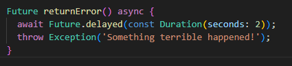

📌 Penjelasan: Method ini mensimulasikan error setelah delay 2 detik. Ini berguna untuk menguji bagaimana aplikasi menangani error dari proses asynchronous.

#### Langkah 2: Ganti Isi Tombol dengan .then().catchError()

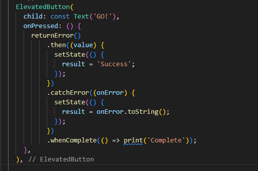

📌 Penjelasan:

then() → dijalankan jika Future berhasil.

catchError() → menangkap error dan menampilkan pesan.

whenComplete() → dijalankan di akhir, baik sukses maupun gagal.

✅ Soal 9:

Capture hasil aplikasi berupa GIF dan tambahkan ke README.md. Commit dengan pesan:


#### Langkah 3: Tambahkan Method handleError() dengan try-catch-finally

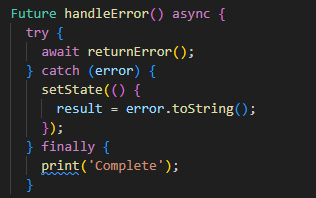

📌 Penjelasan:

try → mencoba menjalankan returnError().

catch → menangkap error dan menampilkan ke UI.

finally → dijalankan di akhir, apapun hasilnya.

#### Langkah 4: Ganti Tombol untuk Memanggil handleError()

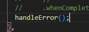

✅ Soal 10:

Jelaskan perbedaan kode langkah 2 dan 4!

✍️ Jawaban Soal 10:
Langkah 2 menggunakan pendekatan chaining dengan .then().catchError().whenComplete() yang cocok untuk penanganan event-driven dan chaining.

Langkah 4 menggunakan async/await dengan try-catch-finally, yang lebih linear dan mudah dibaca, terutama saat ada banyak proses berurutan.

Keduanya menangani error dengan baik, namun async/await lebih cocok untuk kode yang kompleks dan berurutan.

### 📸 Dokumentasi Praktikum


## 📘 Praktikum 6: Menggunakan Future dengan StatefulWidget

### 🎯 Tujuan

Menampilkan data lokasi GPS pengguna menggunakan plugin geolocator, dan mengelola hasilnya dengan StatefulWidget agar bisa ditampilkan di UI.

### 🧱 Langkah-langkah Praktikum

#### Langkah 1: Install Plugin Geolocator

bash
flutter pub add geolocator

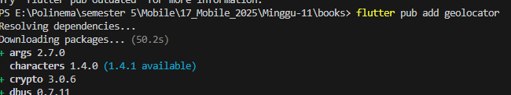

📌 Penjelasan: Plugin geolocator digunakan untuk mengambil data lokasi GPS pengguna.

#### Langkah 2: Tambahkan Permission GPS

Untuk Android:
Tambahkan di android/app/src/main/AndroidManifest.xml:

xml
<uses-permission android:name="android.permission.ACCESS_FINE_LOCATION" />
<uses-permission android:name="android.permission.ACCESS_COARSE_LOCATION" />

Untuk iOS:
Tambahkan di ios/Runner/Info.plist:

xml
<key>NSLocationWhenInUseUsageDescription</key>
<string>This app needs to access your location</string>

Karena saya menggunakan android, saya menggunakan yang untuk android

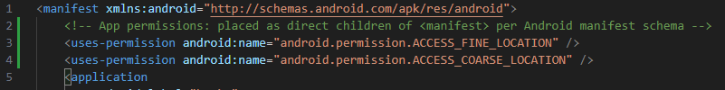

📌 Penjelasan: Ini adalah izin agar aplikasi bisa mengakses lokasi pengguna.

#### Langkah 3: Buat File geolocation.dart

Buat file baru di folder lib:

bash
lib/geolocation.dart

#### Langkah 4: Buat StatefulWidget LocationScreen

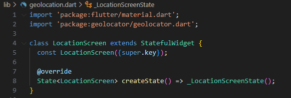

#### Langkah 5: Isi Kode geolocation.dart

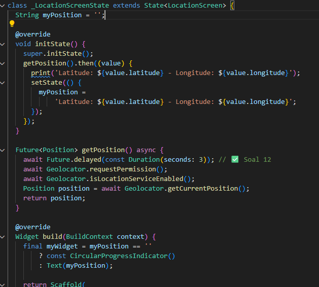

#### Langkah 6: Edit main.dart

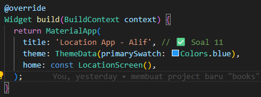

### ✅ Jawaban Soal Praktikum

🔸 Soal 11: Tambahkan nama panggilan
Sudah ditambahkan di title pada AppBar dan MaterialApp.

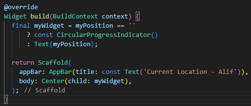

🔸 Soal 12: Tambahkan delay dan jelaskan hasilnya
dart
await Future.delayed(const Duration(seconds: 3));
📌 Penjelasan: Delay ini membuat animasi loading (CircularProgressIndicator) terlihat sebelum data lokasi muncul.

❓ Apakah koordinat GPS muncul saat dijalankan di browser? ❌ Tidak. Karena browser tidak mendukung akses langsung ke sensor GPS perangkat seperti emulator atau device fisik.

### 📸 Dokumentasi Praktikum


## 📘 Praktikum 7: Manajemen Future dengan FutureBuilder

### 🎯 Tujuan

Menggunakan FutureBuilder untuk menampilkan data lokasi GPS secara asynchronous tanpa perlu memanggil setState secara manual.

### 🧱 Langkah-langkah Praktikum

#### Langkah 1: Modifikasi Method getPosition()

Ubah isi method getPosition() di file geolocation.dart menjadi:


📌 Penjelasan: Kita tambahkan delay agar loading spinner (CircularProgressIndicator) muncul sebelum data ditampilkan.

#### Langkah 2: Tambahkan Variabel position

Di dalam class \_LocationScreenState, tambahkan:

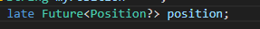

📌 Penjelasan: Variabel ini akan menyimpan Future dari posisi GPS yang akan digunakan oleh FutureBuilder.

#### Langkah 3: Tambahkan initState()

Tambahkan method berikut:

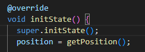

📌 Penjelasan: Saat widget dibuat, kita langsung memanggil getPosition() dan menyimpan hasilnya di position.

#### Langkah 4: Edit Method build()

Ubah method build() menjadi:

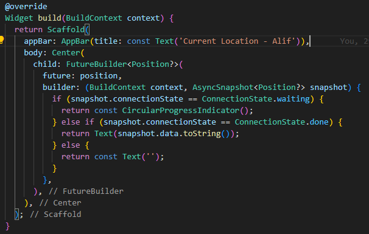

📌 Penjelasan: FutureBuilder akan otomatis membangun ulang UI saat status Future berubah. Tidak perlu lagi memanggil setState() secara manual.

✅ Soal 13:

Apakah ada perbedaan UI dengan praktikum sebelumnya? Jawaban: Ya, sekarang kita menggunakan FutureBuilder yang secara otomatis mengatur tampilan berdasarkan status Future. UI jadi lebih bersih dan reaktif tanpa perlu setState().

📸 Capture hasil aplikasi dan tambahkan ke README.md. 💾 Commit:

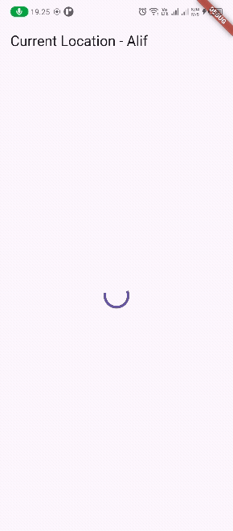

bash
git commit -m "W11: Soal 13"

#### Langkah 5: Tambahkan Handling Error

Ubah bagian ConnectionState.done menjadi:

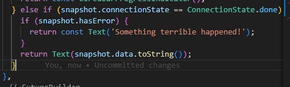

📌 Penjelasan: Kita tambahkan pengecekan snapshot.hasError untuk menangani jika terjadi error saat mengambil lokasi.

✅ Soal 14:

Apakah ada perbedaan UI dengan langkah sebelumnya? Jawaban: Ya, sekarang jika terjadi error, UI akan menampilkan pesan 'Something terrible happened!' daripada kosong atau crash. Ini membuat aplikasi lebih tangguh dan informatif.

### 📸 Capture hasil error dan tambahkan ke README.md. 💾 Commit:


bash
git commit -m "W11: Soal 14"

### ✨ Kesimpulan

FutureBuilder adalah cara yang lebih efisien dan reaktif untuk mengelola data asynchronous di Flutter.

Kita tidak perlu lagi memanggil setState() secara manual.

Penanganan error jadi lebih mudah dan UI tetap stabil.

## 📘 Praktikum 8: Navigation Route dengan Future Function

### 🎯 Tujuan

Menggunakan Navigator.push() sebagai fungsi asynchronous untuk menerima data dari screen kedua dan memperbarui tampilan screen pertama secara dinamis.

### 🧱 Langkah-langkah Praktikum

#### Langkah 1: Buat File navigation_first.dart

Buat file baru di folder lib:

bash
lib/navigation_first.dart

#### Langkah 2: Isi Kode navigation_first.dart

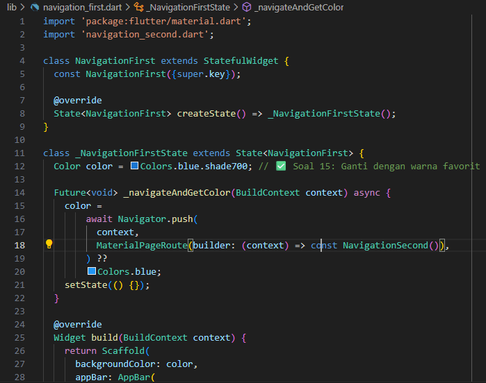

📌 Penjelasan:

Navigator.push() mengembalikan Future yang berisi data dari screen kedua.

Setelah screen kedua ditutup, warna yang dipilih akan dikembalikan dan digunakan untuk mengubah background screen pertama.

#### Langkah 3: Buat File navigation_second.dart

bash
lib/navigation_second.dart

#### Langkah 4: Isi Kode navigation_second.dart

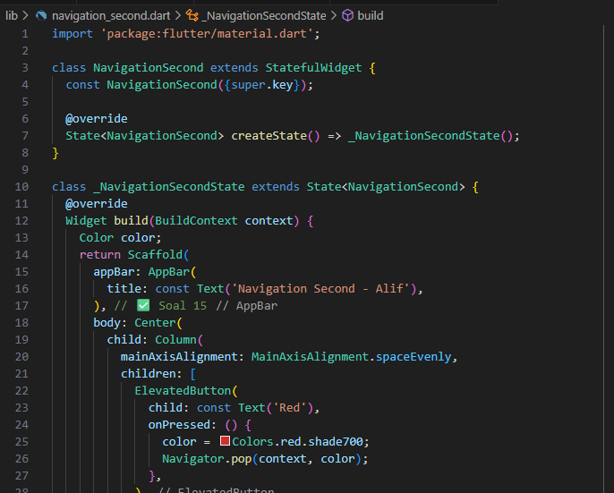

📌 Penjelasan:

Tiap tombol mengembalikan warna yang dipilih ke screen pertama menggunakan Navigator.pop(context, color).

#### Langkah 5: Edit main.dart

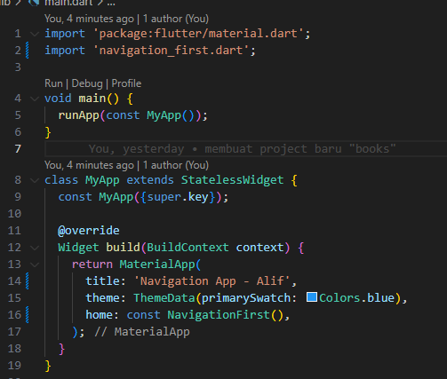

### ✅ Jawaban Soal Praktikum

🔸 Soal 15: Tambahkan nama panggilan dan warna favorit
Sudah ditambahkan di AppBar.title dan warna favorit diganti menjadi purple.

🔸 Soal 16: Apa yang terjadi saat tombol ditekan?
Ketika tombol ditekan di screen kedua, warna yang dipilih dikirim kembali ke screen pertama. Screen pertama langsung mengubah warna background-nya sesuai pilihan. Ini terjadi karena Navigator.push() bersifat asynchronous dan menunggu hasil dari screen kedua.

### 📸 Capture hasil aplikasi saat warna berubah dan konversi ke GIF.


## 📘 Praktikum 9: Memanfaatkan async/await dengan Widget Dialog

### 🎯 Tujuan

Menggunakan AlertDialog sebagai fungsi asynchronous untuk menerima pilihan warna dari pengguna, lalu memperbarui tampilan berdasarkan hasil dialog.

### 🧱 Langkah-langkah Praktikum

#### Langkah 1: Buat File Baru

Buat file baru di folder lib:

bash
lib/navigation_dialog.dart

#### Langkah 2: Isi Kode navigation_dialog.dart

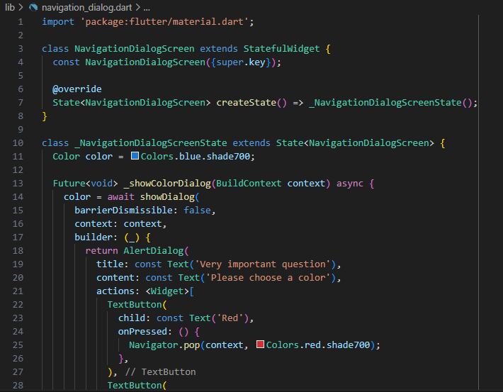

📌 Penjelasan:

showDialog() mengembalikan Future<Color> berdasarkan pilihan pengguna.

Setelah dialog ditutup, warna yang dipilih digunakan untuk mengubah background screen.

#### Langkah 3: Edit main.dart

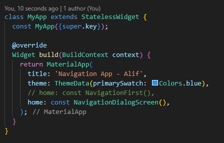

### ✅ Jawaban Soal Praktikum

🔸 Soal 17: Cobalah klik setiap button, apa yang terjadi? Mengapa demikian?
Ketika tombol Red, Green, atau Purple ditekan, dialog akan ditutup dan mengembalikan warna yang dipilih ke fungsi \_showColorDialog(). Fungsi ini menunggu hasil dari dialog menggunakan await, lalu memperbarui warna background dengan setState(). Ini terjadi karena showDialog() adalah fungsi asynchronous yang mengembalikan nilai saat pengguna membuat pilihan.

### 📸 Capture hasil aplikasi saat warna berubah dan konversi ke GIF. 💾 Commit:


bash
git commit -m "W11: Soal 17"

### ✨ Kesimpulan

AlertDialog bisa digunakan sebagai fungsi asynchronous untuk menerima input dari pengguna.

Dengan await, kita bisa menunggu hasil dialog dan langsung memperbarui UI.

Praktikum ini menunjukkan bagaimana Flutter mengintegrasikan UI dan logika asynchronous secara elegan.
