# 11 | Pemrograman Asynchronus

## 📘 Praktikum 1: Mengunduh Data dari Web Service (API)

### 🎯 Tujuan

Membuat aplikasi Flutter yang mengambil data dari Google Books API secara asynchronous dan menampilkannya di layar.

### 🧱 Langkah-langkah Praktikum

#### Langkah 1: Buat Project Baru

`flutter create books`

`cd books`

`flutter pub add http`

📌 Penjelasan: Kita membuat project Flutter bernama books, lalu menambahkan dependency http agar bisa melakukan request ke API.

#### Langkah 2: Cek pubspec.yaml

📌 Penjelasan: Pastikan plugin http sudah terpasang. Jika kamu pakai macOS, tambahkan entitlements agar bisa akses jaringan.

#### Langkah 3: Buka dan Tulis main.dart

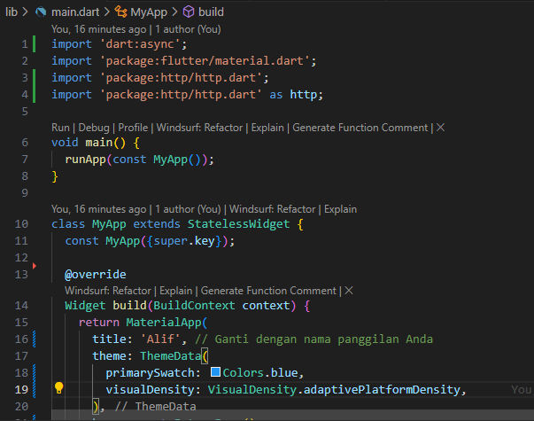

📌 Penjelasan: Ini adalah struktur dasar aplikasi Flutter. Kita menggunakan MaterialApp dan menambahkan nama panggilan di title sebagai identitas.

#### Langkah 4: Tambahkan Method getData()

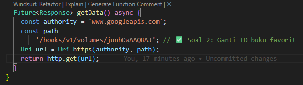

📌 Penjelasan: Method ini membuat request ke Google Books API. ✅ Soal 2: Kamu diminta mencari buku favorit di Google Books, lalu ambil ID dari URL dan ganti di path.

#### Langkah 5: Tambahkan Tombol dan Tampilkan Data

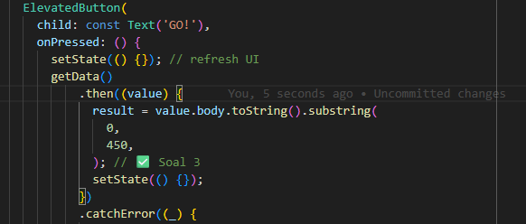

### ✅ Jawaban Soal Praktikum

🔸 Soal 1: Tambahkan nama panggilan
Sudah ditambahkan di title: 'Books App - Alif'.

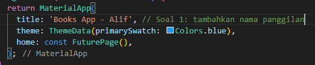

🔸 Soal 2: Ganti ID buku favorit
Sudah diganti dengan ID junbDwAAQBAJ dari buku favorit di Google Books.

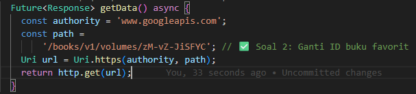

🔸 Soal 3: Jelaskan substring dan catchError
substring(0, 450) → digunakan untuk memotong isi response agar hanya menampilkan 450 karakter pertama. Ini berguna agar tampilan tidak terlalu panjang dan tetap rapi.

catchError → digunakan untuk menangkap error dari proses asynchronous. Jika terjadi error (misalnya koneksi gagal), maka akan menampilkan pesan 'An error occurred' dan mencegah aplikasi crash.

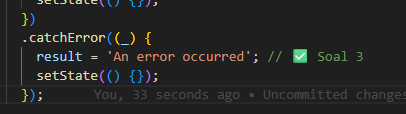

### 📸 Dokumentasi Akhir Praktikum 1

## 📘 Praktikum 2: Menggunakan await/async untuk Menghindari Callbacks

### 🎯 Tujuan

Menghindari callback berlapis dengan menggunakan async dan await agar kode lebih rapi dan mudah dirawat.

### 🧱 Langkah-langkah Praktikum

#### Langkah 1: Tambahkan 3 Method Asynchronous

Tambahkan method berikut ke dalam class \_FuturePageState:

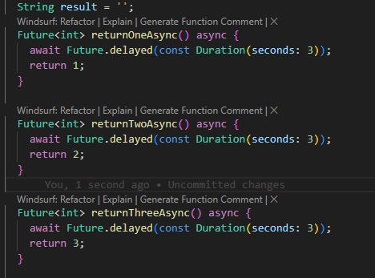

📌 Penjelasan: Setiap method mensimulasikan proses asynchronous selama 3 detik, lalu mengembalikan nilai integer. Ini seperti menunggu respons dari server.

#### Langkah 2: Tambahkan Method count()

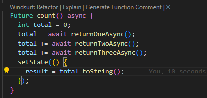

📌 Penjelasan:

await digunakan untuk menunggu hasil dari masing-masing method.

Nilai dikumpulkan ke dalam total.

Setelah semua selesai, setState() dipanggil untuk menampilkan hasil ke UI.

#### Langkah 3: Panggil count() di Tombol

Ubah isi tombol ElevatedButton menjadi:

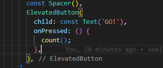

📌 Penjelasan: Ketika tombol ditekan, fungsi count() dijalankan. Karena semua proses asynchronous dijalankan secara berurutan, total waktu tunggu adalah 9 detik.

#### Langkah 4: Jalankan Aplikasi

Jalankan aplikasi dengan F5 atau flutter run.

Setelah 9 detik, hasil 6 akan muncul di layar.

### ✅ Jawaban Soal 4

Soal 4: Jelaskan maksud kode langkah 1 dan 2 tersebut!

Jawaban:
Langkah 1: Tiga method returnOneAsync(), returnTwoAsync(), dan returnThreeAsync() adalah simulasi proses asynchronous yang masing-masing menunggu selama 3 detik sebelum mengembalikan nilai 1, 2, dan 3.

Langkah 2: Method count() menjalankan ketiga method tersebut secara berurutan menggunakan await, menjumlahkan hasilnya ke dalam variabel total, lalu menampilkan hasilnya ke UI dengan setState().

### 📸 Dokumentasi Praktikum

## 📘 Praktikum 3: Menggunakan Completer di Future

### 🎯 Tujuan

Memahami cara kerja Completer untuk membuat dan menyelesaikan Future secara manual, serta membandingkannya dengan pendekatan then dan catchError.

### 🧱 Langkah-langkah Praktikum

#### Langkah 1: Import Package async

Tambahkan import berikut di bagian atas main.dart:

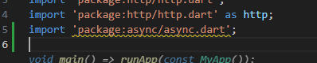

📌 Penjelasan: Package ini menyediakan class Completer yang digunakan untuk membuat Future secara manual.

#### Langkah 2: Tambahkan Variabel dan Method

Tambahkan di dalam class \_FuturePageState:

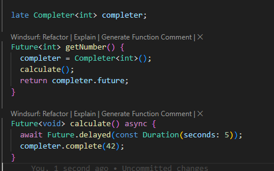

📌 Penjelasan:

Completer<int> membuat objek Future yang belum selesai.

getNumber() menginisialisasi Completer, memanggil calculate(), dan mengembalikan Future.

calculate() menunggu 5 detik, lalu menyelesaikan Future dengan nilai 42.

#### Soal 5: Jelaskan maksud kode langkah 2 tersebut!

Kode tersebut membuat Future secara manual menggunakan Completer. Fungsi getNumber() mengembalikan Future yang belum selesai, dan fungsi calculate() menyelesaikannya setelah 5 detik dengan nilai 42. Ini berguna saat kita ingin mengontrol kapan dan bagaimana Future diselesaikan.

#### Langkah 3: Ganti Isi Tombol onPressed

Ubah tombol menjadi:

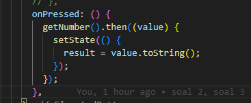

📌 Penjelasan: Ketika tombol ditekan, getNumber() dipanggil dan menunggu hasil dari Completer. Setelah 5 detik, nilai 42 ditampilkan di UI.

#### Langkah 4: Jalankan Aplikasi

Jalankan dengan F5 atau flutter run.

Setelah 5 detik, angka 42 akan muncul di layar.

#### Langkah 5: Ganti Method calculate()

Ubah isi method calculate() menjadi:

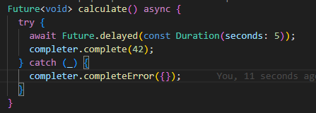

Atau buat versi baru calculate2() jika ingin membandingkan.

#### Langkah 6: Ganti Isi Tombol onPressed

Ubah menjadi:

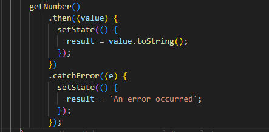

📌 Penjelasan: Ini adalah versi dengan then dan catchError untuk menangani error jika Completer gagal diselesaikan.

#### ✅ Soal 6: Jelaskan maksud perbedaan kode langkah 2 dengan langkah 5-6 tersebut!

Langkah 2 menggunakan pendekatan async/await untuk menyelesaikan Future secara manual dan langsung mengupdate UI. Langkah 5-6 menggunakan pendekatan then/catchError untuk menangani hasil dan error dari Future. Perbedaannya terletak pada gaya penulisan dan cara menangani hasil: async/await lebih linear dan mudah dibaca, sedangkan then/catchError lebih cocok untuk chaining dan penanganan error eksplisit.

## 📸 Dokumentasi Praktikum

## 📘 Praktikum 4: Memanggil Future Secara Paralel

### 🎯 Tujuan

Menjalankan beberapa Future secara paralel menggunakan FutureGroup dan Future.wait, lalu membandingkan efisiensi waktu dan gaya penulisan.

### 🧱 Langkah-langkah Praktikum

#### Langkah 1: Tambahkan Method returnFG()

Tambahkan method ini ke dalam class \_FuturePageState:

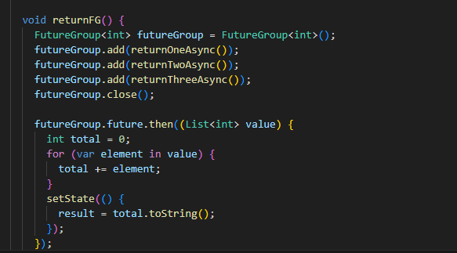

📌 Penjelasan:

FutureGroup digunakan untuk menjalankan beberapa Future sekaligus.

Setelah semua selesai, hasilnya berupa List<int>.

Nilai dijumlahkan dan ditampilkan ke UI.

#### Langkah 2: Panggil returnFG() di Tombol

Ubah isi tombol menjadi:

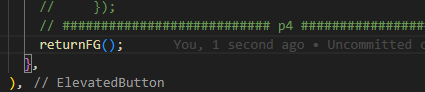

📌 Penjelasan: Ketika tombol ditekan, ketiga proses asynchronous dijalankan secara bersamaan, bukan berurutan.

#### Langkah 3: Jalankan Aplikasi

Jalankan aplikasi.

✅ Soal 7:

#### Langkah 4: Ganti dengan Future.wait

Ubah method menjadi:

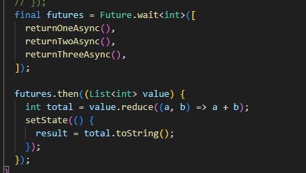

📌 Penjelasan:

Future.wait adalah cara native dari Dart untuk menjalankan banyak Future paralel.

Hasilnya juga berupa List<int>, lalu dijumlahkan.

✅ Soal 8:

Jelaskan maksud perbedaan kode langkah 1 dan 4!

#### ✍️ Jawaban Soal 8:

Langkah 1 menggunakan FutureGroup dari package async, yang memberi kontrol lebih seperti menambahkan Future satu per satu dan menutup grup secara eksplisit.

Langkah 4 menggunakan Future.wait, yang lebih ringkas dan merupakan fitur bawaan Dart.

Keduanya menjalankan Future secara paralel dan mengembalikan hasil dalam bentuk List, namun Future.wait lebih sederhana untuk kasus umum.

📸 Dokumentasi Praktikum

