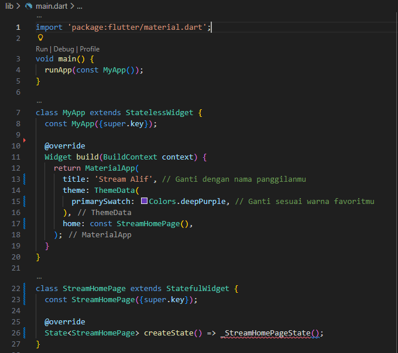
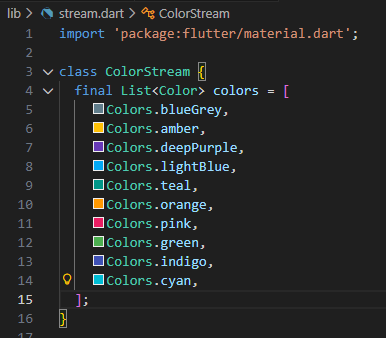
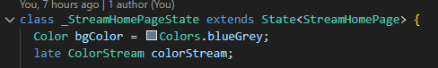
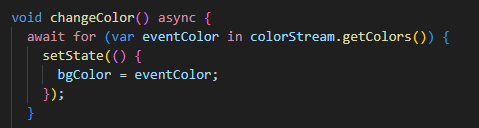
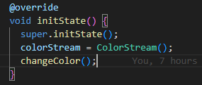
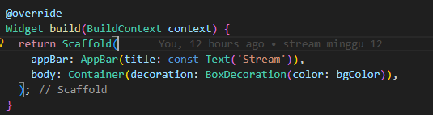
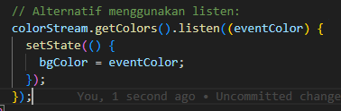

# 12 | Lanjutan State Manajemen dengan Streams

## Praktikum 1: Dart Stream

✅ Langkah 1: Buat Project Baru
Buat project Flutter baru dengan nama stream_namaPanggilan di folder week-12/src/.

bash
flutter create stream_alif
Penjelasan: Ini membuat struktur dasar aplikasi Flutter. Nama project disesuaikan agar mudah dikenali sebagai hasil praktikum pribadi.

✅ Langkah 2: Buka file main.dart

Soal 1 Jawaban:

Nama panggilan ditambahkan pada judul aplikasi: 'Stream Alif'

Warna tema diganti ke Colors.indigo

Commit: "W12: Jawaban Soal 1"

✅ Langkah 3: Buat file baru stream.dart

Soal 2 Jawaban:

Menambahkan 5 warna tambahan sesuai keinginan

Commit: "W12: Jawaban Soal 2"

✅ Langkah 5: Tambah method getColors()

Soal 3 Jawaban:

yield\* digunakan untuk meneruskan stream dari Stream.periodic ke stream utama.

Kode menghasilkan warna baru setiap detik berdasarkan urutan dalam list colors.

Commit: "W12: Jawaban Soal 3"

✅ Langkah 7: Impor stream.dart di main.dart
dart

✅ Langkah 8: Tambah variabel di \_StreamHomePageState
dart

Penjelasan:

bgColor menyimpan warna latar saat ini.

colorStream adalah instance dari class ColorStream.

✅ Langkah 9: Tambah method changeColor()

Penjelasan:

Mendengarkan stream warna dan mengubah warna latar setiap detik.

✅ Langkah 10: Override initState()

Penjelasan:

Inisialisasi colorStream dan mulai mendengarkan perubahan warna saat widget dibuat.

✅ Langkah 11: Ubah isi Scaffold()

Penjelasan:

Menampilkan warna latar yang berubah setiap detik.

✅ Langkah 12: Jalankan aplikasi
Soal 4 Jawaban:

Commit: "W12: Jawaban Soal 4"

✅ Langkah 13: Alternatif method changeColor() menggunakan listen

Soal 5 Jawaban:

listen: langsung berlangganan stream dan menangani event secara reaktif.

await for: digunakan dalam fungsi async untuk menunggu setiap event satu per satu.

Perbedaan utama: listen tidak perlu async, sedangkan await for digunakan dalam fungsi async dan lebih cocok untuk kontrol alur yang kompleks.

Commit: "W12: Jawaban Soal 5"
