# 12 | Lanjutan State Manajemen dengan Streams

## Praktikum 1: Dart Stream

✅ Langkah 1: Buat Project Baru
Buat project Flutter baru dengan nama stream_namaPanggilan di folder week-12/src/.

bash
flutter create stream_alif
Penjelasan: Ini membuat struktur dasar aplikasi Flutter. Nama project disesuaikan agar mudah dikenali sebagai hasil praktikum pribadi.

✅ Langkah 2: Buka file main.dart

Soal 1 Jawaban:

Nama panggilan ditambahkan pada judul aplikasi: 'Stream Alif'

Warna tema diganti ke Colors.indigo

Commit: "W12: Jawaban Soal 1"

✅ Langkah 3: Buat file baru stream.dart

Soal 2 Jawaban:

Menambahkan 5 warna tambahan sesuai keinginan

Commit: "W12: Jawaban Soal 2"

✅ Langkah 5: Tambah method getColors()

Soal 3 Jawaban:

yield\* digunakan untuk meneruskan stream dari Stream.periodic ke stream utama.

Kode menghasilkan warna baru setiap detik berdasarkan urutan dalam list colors.

Commit: "W12: Jawaban Soal 3"

✅ Langkah 7: Impor stream.dart di main.dart
dart

✅ Langkah 8: Tambah variabel di \_StreamHomePageState
dart

Penjelasan:

bgColor menyimpan warna latar saat ini.

colorStream adalah instance dari class ColorStream.

✅ Langkah 9: Tambah method changeColor()

Penjelasan:

Mendengarkan stream warna dan mengubah warna latar setiap detik.

✅ Langkah 10: Override initState()

Penjelasan:

Inisialisasi colorStream dan mulai mendengarkan perubahan warna saat widget dibuat.

✅ Langkah 11: Ubah isi Scaffold()

Penjelasan:

Menampilkan warna latar yang berubah setiap detik.

✅ Langkah 12: Jalankan aplikasi
Soal 4 Jawaban:

Commit: "W12: Jawaban Soal 4"

✅ Langkah 13: Alternatif method changeColor() menggunakan listen

Soal 5 Jawaban:

listen: langsung berlangganan stream dan menangani event secara reaktif.

await for: digunakan dalam fungsi async untuk menunggu setiap event satu per satu.

Perbedaan utama: listen tidak perlu async, sedangkan await for digunakan dalam fungsi async dan lebih cocok untuk kontrol alur yang kompleks.

Commit: "W12: Jawaban Soal 5"

## Praktikum 2: Stream Controllers dan Sinks

✅ Langkah 1: Buka file stream.dart

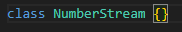

Penjelasan: Membuat class NumberStream sebagai wadah untuk mengelola stream angka. Class ini akan dikembangkan di langkah-langkah berikutnya.

✅ Langkah 2: Tambah StreamController

Penjelasan: StreamController bertugas sebagai penghubung antara Sink dan Stream.

Sink: tempat memasukkan data.

Stream: tempat data keluar dan bisa didengarkan oleh subscriber.

✅ Langkah 3: Tambah method addNumberToSink()

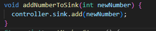

Penjelasan: Method ini digunakan untuk memasukkan angka baru ke dalam stream melalui sink.

✅ Langkah 4: Tambah method close()

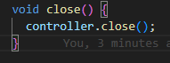

Penjelasan: Menutup stream controller agar tidak terjadi memory leak. Wajib dipanggil saat widget dihapus (dispose()).

✅ Langkah 5: Buka file main.dart dan tambahkan import

Penjelasan:

dart:async: untuk menggunakan StreamController.

dart:math: untuk menghasilkan angka acak.

✅ Langkah 6: Tambah variabel di \_StreamHomePageState

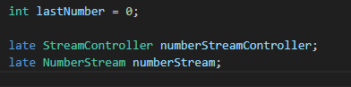

Penjelasan:

lastNumber: menyimpan angka terakhir yang diterima dari stream.

numberStreamController: controller dari stream.

numberStream: instance dari class NumberStream.

✅ Langkah 7: Override initState()

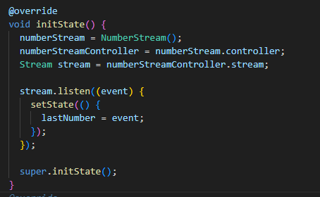

Penjelasan:

Inisialisasi objek NumberStream.

Mendengarkan stream dan mengubah lastNumber setiap kali ada data baru.

✅ Langkah 8: Override dispose()

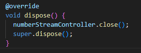

Penjelasan: Menutup stream controller saat widget dihapus agar tidak terjadi kebocoran memori.

✅ Langkah 9: Tambah UI di body

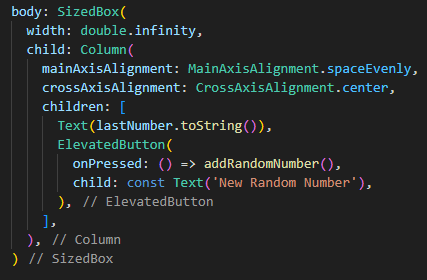

Penjelasan:

Menampilkan angka terakhir.

Tombol untuk menambahkan angka acak ke stream.

✅ Langkah 10: Tambah method addRandomNumber()

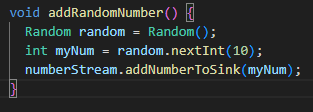

Penjelasan:

Menghasilkan angka acak dari 0–9.

Memasukkan angka ke stream melalui addNumberToSink().

✅ Soal 6: Jelaskan maksud kode langkah 8 dan 10
Jawaban Soal 6:

Langkah 8 (initState): Menginisialisasi stream dan mendengarkan data baru. Setiap data yang masuk akan mengubah nilai lastNumber.

Langkah 10 (addRandomNumber): Menghasilkan angka acak dan mengirimkannya ke stream agar bisa ditampilkan di UI.

Commit: "W12: Jawaban Soal 6"

✅ Langkah 13: Tambah method addError()

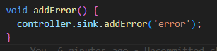

Penjelasan: Menambahkan error ke stream. Berguna untuk menguji penanganan error.

✅ Langkah 14: Tambah onError di initState()

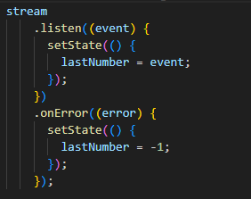

Penjelasan:

Jika terjadi error, nilai lastNumber diubah menjadi -1.

✅ Langkah 15: Edit addRandomNumber() untuk uji error

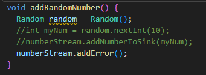

Penjelasan:

Baris asli dikomentari.

Memanggil addError() untuk menguji penanganan error.

✅ Soal 7: Jelaskan maksud kode langkah 13–15
Jawaban Soal 7:

Langkah 13: Menyediakan cara untuk mengirim error ke stream.

Langkah 14: Menangani error dengan mengubah tampilan UI agar menunjukkan nilai -1.

Langkah 15: Menguji apakah error ditangani dengan benar.

Commit: "W12: Jawaban Soal 7"
