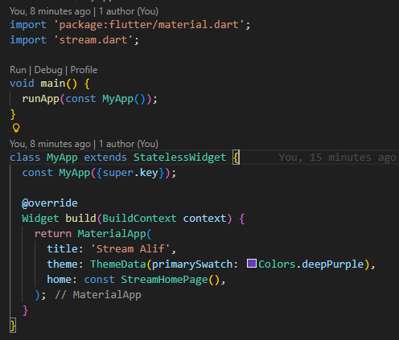
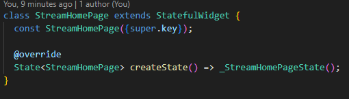
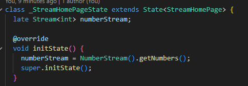
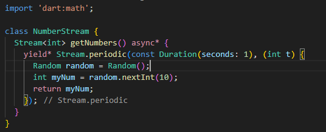

# Praktikum 6: Streambuilder

🛠️ Langkah 1: Buat project Flutter baru
bash
flutter create streambuilder_alif
Penjelasan: Membuat project baru dengan nama streambuilder_alif. Nama ini bisa disesuaikan dengan nama panggilanmu.

📁 Langkah 2: Buka dan edit main.dart

Penjelasan:

MaterialApp digunakan sebagai root aplikasi.

Judul dan warna tema disesuaikan dengan preferensimu.

🎯 Langkah 3: Buat StreamHomePage sebagai StatefulWidget

🔄 Langkah 4: Tambahkan numberStream dan inisialisasi di initState()

Penjelasan:

numberStream akan menerima angka acak dari class NumberStream.

Diinisialisasi saat widget pertama kali dibuat.

🧱 Langkah 5: Bangun UI dengan StreamBuilder

Penjelasan:

StreamBuilder membangun ulang UI setiap kali data baru masuk.

Jika ada error, dicetak ke konsol.

Jika ada data, ditampilkan besar di tengah layar.

Jika belum ada data, tidak menampilkan apapun.

📦 Langkah 6: Buat file baru stream.dart

Penjelasan:

Fungsi getNumbers() menghasilkan angka acak setiap detik.

yield\* meneruskan stream dari Stream.periodic.

🧠 Soal 12: Jelaskan maksud kode pada langkah 3 dan 7
Jawaban Soal 12:

Langkah 3 (StreamBuilder): Widget ini mendengarkan stream dan membangun ulang UI setiap kali data baru tersedia.

Langkah 7 (getNumbers): Fungsi ini menghasilkan angka acak setiap detik dan mengalirkannya melalui stream.

Kombinasi keduanya membuat UI berubah secara otomatis mengikuti data stream.

Commit: "W12: Jawaban Soal 12"

