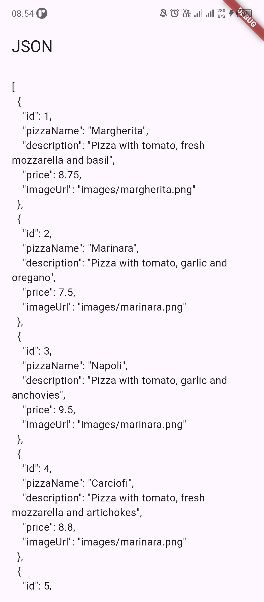
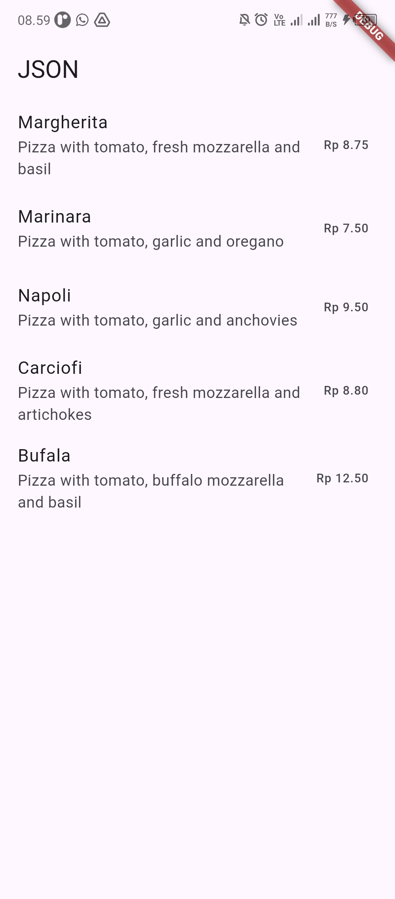
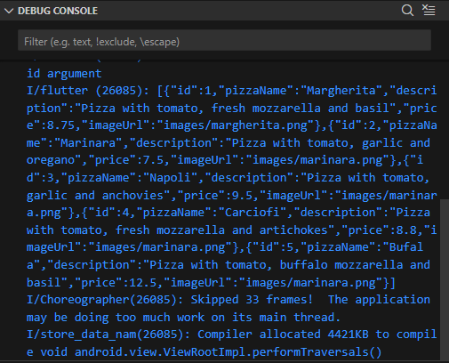

# 13 | Persistensi Data

## Praktikum 1

Struktur File

```struktur kode
week-13/
└── src/
    ├── assets/
    │   └── pizzalist.json
    └── lib/
        └── main.dart
```

Main.dart

```Dart
import 'package:flutter/material.dart';
import 'package:flutter/services.dart' as rootBundle;

void main() {
  runApp(const MyApp());
}

class MyApp extends StatelessWidget {
  const MyApp({super.key});

  @override
  Widget build(BuildContext context) {
    return MaterialApp(
      title: 'Store Data Alif', // Soal 1: nama panggilan
      theme: ThemeData(
        primarySwatch: Colors.indigo, // Soal 1: warna kesukaan
      ),
      home: const MyHomePage(),
    );
  }
}

class MyHomePage extends StatefulWidget {
  const MyHomePage({super.key});

  @override
  State<MyHomePage> createState() => _MyHomePageState();
}

class _MyHomePageState extends State<MyHomePage> {
  String pizzaString = "";

  @override
  void initState() {
    super.initState();
    readJsonFile();
  }

  Future<void> readJsonFile() async {
    final jsonString = await rootBundle.rootBundle.loadString(
      'assets/pizzalist.json',
    );
    setState(() {
      pizzaString = jsonString;
    });
  }

  @override
  Widget build(BuildContext context) {
    return Scaffold(
      appBar: AppBar(title: const Text("W13: Jawaban Soal 1")),
      body: Padding(
        padding: const EdgeInsets.all(16),
        child: Text(pizzaString),
      ),
    );
  }
}
```

pizzalist.json

```json
[
  {
    "id": 1,
    "pizzaName": "Margherita",
    "description": "Pizza with tomato, fresh mozzarella and basil",
    "price": 8.75,
    "imageUrl": "images/margherita.png"
  },
  {
    "id": 2,
    "pizzaName": "Marinara",
    "description": "Pizza with tomato, garlic and oregano",
    "price": 7.5,
    "imageUrl": "images/marinara.png"
  },
  {
    "id": 3,
    "pizzaName": "Napoli",
    "description": "Pizza with tomato, garlic and anchovies",
    "price": 9.5,
    "imageUrl": "images/marinara.png"
  },
  {
    "id": 4,
    "pizzaName": "Carciofi",
    "description": "Pizza with tomato, fresh mozzarella and artichokes",
    "price": 8.8,
    "imageUrl": "images/marinara.png"
  },
  {
    "id": 5,
    "pizzaName": "Bufala",
    "description": "Pizza with tomato, buffalo mozzarella and basil",
    "price": 12.5,
    "imageUrl": "images/marinara.png"
  }
]
```

output



main.dart

```dart
import 'dart:convert';
import 'package:flutter/material.dart';
import 'package:flutter/services.dart' as rootBundle;
import 'model/pizza.dart';

void main() {
  runApp(const MyApp());
}

class MyApp extends StatelessWidget {
  const MyApp({super.key});

  @override
  Widget build(BuildContext context) {
    return MaterialApp(
      title: 'Store Data Alif',
      theme: ThemeData(primarySwatch: Colors.indigo),
      home: const MyHomePage(),
    );
  }
}

class MyHomePage extends StatefulWidget {
  const MyHomePage({super.key});

  @override
  State<MyHomePage> createState() => _MyHomePageState();
}

class _MyHomePageState extends State<MyHomePage> {
  List<Pizza> myPizzas = [];

  @override
  void initState() {
    super.initState();
    readJsonFile().then((value) {
      setState(() {
        myPizzas = value;
      });
    });
  }

  Future<List<Pizza>> readJsonFile() async {
    final jsonString = await rootBundle.rootBundle.loadString(
      'assets/pizzalist.json',
    );
    final List<dynamic> pizzaMapList = jsonDecode(jsonString);
    final List<Pizza> pizzas = pizzaMapList
        .map((data) => Pizza.fromJson(data))
        .toList();
    return pizzas;
  }

  @override
  Widget build(BuildContext context) {
    return Scaffold(
      appBar: AppBar(title: const Text("JSON")),
      body: ListView.builder(
        itemCount: myPizzas.length,
        itemBuilder: (context, index) {
          final pizza = myPizzas[index];
          return ListTile(
            title: Text(pizza.pizzaName),
            subtitle: Text(pizza.description),
            trailing: Text("Rp ${pizza.price.toStringAsFixed(2)}"),
          );
        },
      ),
    );
  }
}
```

pizza.dart

```dart
class Pizza {
  final int id;
  final String pizzaName;
  final String description;
  final double price;
  final String imageUrl;

  Pizza({
    required this.id,
    required this.pizzaName,
    required this.description,
    required this.price,
    required this.imageUrl,
  });

  factory Pizza.fromJson(Map<String, dynamic> json) {
    return Pizza(
      id: json['id'],
      pizzaName: json['pizzaName'],
      description: json['description'],
      price: (json['price'] as num).toDouble(),
      imageUrl: json['imageUrl'],
    );
  }
}
```

output



tambahkan kode to pizza.dart

```dart
Map<String, dynamic> toJson() {
  return {
    'id': id,
    'pizzaName': pizzaName,
    'description': description,
    'price': price,
    'imageUrl': imageUrl,
  };
}
```

tambahkan kode ke main

```dart
String convertToJSON(List<Pizza> pizzas) {
  final List<Map<String, dynamic>> jsonList =
      pizzas.map((pizza) => pizza.toJson()).toList();
  return jsonEncode(jsonList);
}
```

```dart
String convertToJSON(List<Pizza> pizzas) {
  final List<Map<String, dynamic>> jsonList =
      pizzas.map((pizza) => pizza.toJson()).toList();
  return jsonEncode(jsonList);
}
```

output debug console



## Praktikum 2


## Praktikum 3
