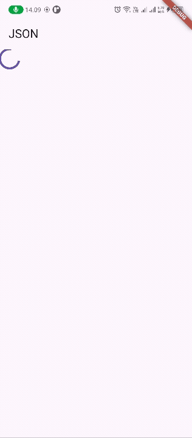
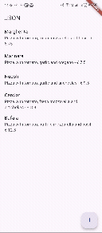
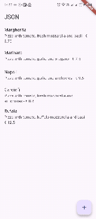

# pizzalist

🔧 Praktikum 1: Membuat Layanan Mock API
Langkah 1: Setup WireMock Cloud
Daftar di WireMock Cloud

Buat stub baru:

Name: Pizza List

Method: GET

Endpoint: /pizzalist

Response: JSON dari <https://bit.ly/pizzalist>

Contoh JSON:

```json
[
  {
    "id": 1,
    "pizzaName": "Margherita",
    "description": "Pizza with tomato, fresh mozzarella and basil",
    "price": 8.75,
    "imageUrl": "images/margherita.png"
  },
  {
    "id": 2,
    "pizzaName": "Marinara",
    "description": "Pizza with tomato, garlic and oregano",
    "price": 7.5,
    "imageUrl": "images/marinara.png"
  },
  {
    "id": 3,
    "pizzaName": "Napoli",
    "description": "Pizza with tomato, garlic and anchovies",
    "price": 9.5,
    "imageUrl": "images/marinara.png"
  },
  {
    "id": 4,
    "pizzaName": "Carciofi",
    "description": "Pizza with tomato, fresh mozzarella and artichokes",
    "price": 8.8,
    "imageUrl": "images/marinara.png"
  },
  {
    "id": 5,
    "pizzaName": "Bufala",
    "description": "Pizza with tomato, buffalo mozzarella and basil",
    "price": 12.5,
    "imageUrl": "images/marinara.png"
  }
]
```

📦 Langkah 2: Tambahkan Dependency http
Di terminal proyek Flutter:

```bash
flutter pub add http
```

📁 Langkah 3: Buat File httphelper.dart

```dart
import 'dart:convert';
import 'dart:io';
import 'package:http/http.dart' as http;
import 'pizza.dart';

class HttpHelper {
  final String authority = 'w5v59.wiremockapi.cloud';
  final String path = 'pizzalist';
  static final HttpHelper _httpHelper = HttpHelper._internal();
  HttpHelper._internal();
  factory HttpHelper() {
    return _httpHelper;
  }
  Future<List<Pizza>> getPizzaList() async {
    final Uri url = Uri.https(authority, path);
    final http.Response result = await http.get(url);
    if (result.statusCode == HttpStatus.ok) {
      final jsonResponse = json.decode(result.body);
      List<Pizza> pizzas = jsonResponse
          .map<Pizza>((i) => Pizza.fromJson(i))
          .toList();
      return pizzas;
    } else {
      return [];
    }
  }
}
```

🧠 Penjelasan:

Menggunakan singleton agar hanya satu instance HttpHelper dibuat.

getPizzaList() mengambil data dari endpoint dan mengubahnya jadi list Pizza.

🧩 Langkah 4: Tambahkan Fungsi di main.dart

```dart
Future<List<Pizza>> callPizzas() async {
HttpHelper helper = HttpHelper();
List<Pizza> pizzas = await helper.getPizzaList();
return pizzas;
}
```

🖼️ Langkah 5: Tampilkan Data dengan FutureBuilder

```dart
FutureBuilder<List<Pizza>>(
future: callPizzas(),
builder: (context, snapshot) {
if (snapshot.hasError) {
return const Text('Something went wrong');
}
if (!snapshot.hasData) {
return const CircularProgressIndicator();
}

    return ListView.builder(
      itemCount: snapshot.data!.length,
      itemBuilder: (context, index) {
        final pizza = snapshot.data![index];
        return ListTile(
          title: Text(pizza.name),
          subtitle: Text('${pizza.description} - € ${pizza.price}'),
        );
      },
    );

},
)
```

📝 Jawaban Soal
Soal 1: Tambahkan nama panggilan dan ubah warna tema
Contoh:

```dart
return MaterialApp(
title: 'Pizza App - Alif',
theme: ThemeData(
primarySwatch: Colors.deepPurple,
),
home: MyHomePage(),
);
```

❓ Pertanyaan Praktikum

1. Apa manfaat menggunakan layanan mock seperti WireMock?
   Jawaban: Memungkinkan pengujian aplikasi tanpa backend nyata, mempercepat pengembangan dan debugging.

2. Mengapa kita menggunakan FutureBuilder?
   Jawaban: Untuk membangun UI berdasarkan hasil asynchronous dari API, seperti menampilkan loading, error, atau data.

3. Apa keuntungan menggunakan pola singleton di HttpHelper?
   Jawaban: Menghemat resource dan menjaga konsistensi akses ke API dari satu instance saja.

Output



## Praktikum 2

🧪 Langkah 1: Buat Stub POST di WireMock
Method: POST

Endpoint: /pizza

Status: 201

Response Body:

```json
{
  "message": "The pizza was posted"
}
```

Ini akan menjadi target endpoint untuk mengirim data pizza dari aplikasi Flutter.

📁 Langkah 2: Tambahkan Fungsi postPizza() di httphelper.dart
Kode:

```dart
Future<String> postPizza(Pizza pizza) async {
    const postPath = '/pizza';
    String post = json.encode(pizza.toJson());
    Uri url = Uri.https(authority, postPath);
    http.Response r = await http.post(url, body: post);
    return r.body;
  }
```

🧠 Penjelasan:
Mengubah objek Pizza menjadi JSON.

Mengirim POST ke endpoint /pizza.

Jika berhasil, mengembalikan pesan dari server.

📄 Langkah 3: Buat File pizza_detail.dart
Kode:

```dart
import 'package:flutter/material.dart';
import 'pizza.dart';
import 'httphelper.dart';

class PizzaDetailScreen extends StatefulWidget {
const PizzaDetailScreen({super.key});

@override
State<PizzaDetailScreen> createState() => \_PizzaDetailScreenState();
}

class \_PizzaDetailScreenState extends State<PizzaDetailScreen> {
final idController = TextEditingController();
final nameController = TextEditingController();
final descController = TextEditingController();
final priceController = TextEditingController();
final imageController = TextEditingController();

String resultMessage = '';

@override
void dispose() {
idController.dispose();
nameController.dispose();
descController.dispose();
priceController.dispose();
imageController.dispose();
super.dispose();
}

Future<void> sendPizza() async {
    final pizza = Pizza(
      id: int.parse(idController.text),
      pizzaName: nameController.text,
      description: descController.text,
      price: double.parse(priceController.text),
      imageUrl: imageController.text,
);

    final helper = HttpHelper();
    final result = await helper.postPizza(pizza);

    setState(() {
      resultMessage = result;
    });

}

@override
Widget build(BuildContext context) {
return Scaffold(
appBar: AppBar(title: const Text('Pizza Detail')),
body: Padding(
padding: const EdgeInsets.all(12),
child: SingleChildScrollView(
child: Column(
children: [
Text(resultMessage, style: const TextStyle(color: Colors.green)),
const SizedBox(height: 24),
TextField(controller: idController, decoration: const InputDecoration(labelText: 'Insert ID')),
const SizedBox(height: 24),
TextField(controller: nameController, decoration: const InputDecoration(labelText: 'Insert Pizza Name')),
const SizedBox(height: 24),
TextField(controller: descController, decoration: const InputDecoration(labelText: 'Insert Description')),
const SizedBox(height: 24),
TextField(controller: priceController, decoration: const InputDecoration(labelText: 'Insert Price')),
const SizedBox(height: 24),
TextField(controller: imageController, decoration: const InputDecoration(labelText: 'Insert Image Url')),
const SizedBox(height: 48),
ElevatedButton(
onPressed: sendPizza,
child: const Text('Send Post'),
),
],
),
),
),
);
}
}
```

🧭 Langkah 4: Navigasi dari main.dart
Tambahkan tombol di MyHomePage untuk membuka PizzaDetailScreen:

```dart
floatingActionButton: FloatingActionButton(
onPressed: () {
Navigator.push(
context,
MaterialPageRoute(builder: (context) => const PizzaDetailScreen()),
);
},
child: const Icon(Icons.add),
),
```

✅ Hasil yang Diharapkan
Setelah mengisi form dan menekan tombol Send Post, kamu akan melihat pesan:

```json
"message": "The pizza was posted"
```

❓ Jawaban Pertanyaan Praktikum

1. Apa perbedaan utama antara GET dan POST?
   Jawaban:

GET digunakan untuk mengambil data dari server.

POST digunakan untuk mengirim data baru ke server.

2. Mengapa kita perlu mengubah objek menjadi JSON sebelum dikirim?
   Jawaban: Karena server web biasanya menerima data dalam format JSON, bukan objek Dart.

3. Apa yang terjadi jika respons dari server bukan status 201?
   Jawaban: Fungsi postPizza() akan mengembalikan 'Failed to post pizza', dan UI akan menampilkan pesan error.

Output



## Praktikum 3

🔧 Langkah 1: Buat Stub PUT di WireMock
Method: PUT

Endpoint: /pizza

Status: 200

Response Body:

```json
{
  "message": "Pizza was updated"
}
```

Stub ini akan menerima permintaan PUT dan mengembalikan respons sukses.

📁 Langkah 2: Tambahkan Fungsi putPizza() di httphelper.dart
Kode:

```dart
Future<String> putPizza(Pizza pizza) async {
  const putPath = '/pizza';
  String put = json.encode(pizza.toJson());
  Uri url = Uri.https(authority, putPath);
  http.Response r = await http.put(
    url,
    body: put,
  );
  return r.body;
}
```

🧠 Penjelasan:
Mirip dengan postPizza(), tapi menggunakan http.put() untuk memperbarui data.

Mengirim JSON ke endpoint /pizza.

Mengembalikan pesan sukses jika status 200.

🖼️ Langkah 3: Modifikasi PizzaDetailScreen agar mendukung PUT
Tambahkan properti Pizza pizza dan bool isNew di konstruktor:

```dart
final Pizza pizza;
final bool isNew;

const PizzaDetailScreen({required this.pizza, required this.isNew, super.key});
Isi controller dengan data pizza jika isNew == false:

dart
@override
void initState() {
  super.initState();
  if (!widget.isNew) {
    idController.text = widget.pizza.id.toString();
    nameController.text = widget.pizza.name;
    descController.text = widget.pizza.description;
    priceController.text = widget.pizza.price.toString();
    imageController.text = widget.pizza.image;
  }
}
```

Ubah fungsi sendPizza() agar memilih antara POST dan PUT:

```dart
Future<void> sendPizza() async {
  final pizza = Pizza(
    id: int.parse(idController.text),
    name: nameController.text,
    description: descController.text,
    price: double.parse(priceController.text),
    image: imageController.text,
  );

  final helper = HttpHelper();
  final result = widget.isNew
      ? await helper.postPizza(pizza)
      : await helper.putPizza(pizza);

  setState(() {
    resultMessage = result;
  });
}
```

🧭 Langkah 4: Navigasi dari main.dart
Tambahkan dua navigasi:

Untuk tambah pizza baru (POST):

```dart
floatingActionButton: FloatingActionButton(
  onPressed: () {
    Navigator.push(
      context,
      MaterialPageRoute(
        builder: (context) => PizzaDetailScreen(
          pizza: Pizza(id: 0, name: '', description: '', price: 0.0, image: ''),
          isNew: true,
        ),
      ),
    );
  },
  child: const Icon(Icons.add),
),
```

Untuk edit pizza (PUT), misalnya di ListTile:

```dart
onTap: () {
  Navigator.push(
    context,
    MaterialPageRoute(
      builder: (context) => PizzaDetailScreen(
        pizza: pizza,
        isNew: false,
      ),
    ),
  );
},
```

✅ Hasil yang Diharapkan
Jika kamu mengetuk pizza yang sudah ada, kamu bisa mengeditnya.

Setelah menekan tombol Send Post, kamu akan melihat:

```json
"message": "Pizza was updated"
```

❓ Jawaban Pertanyaan Praktikum

1. Apa perbedaan antara POST dan PUT?
   Jawaban:

POST digunakan untuk menambahkan data baru.

PUT digunakan untuk memperbarui data yang sudah ada.

2. Mengapa kita perlu membedakan antara pizza baru dan pizza lama?
   Jawaban: Karena pizza baru harus dikirim dengan POST, sedangkan pizza lama harus dikirim dengan PUT agar server tahu bahwa data sedang diperbarui, bukan ditambahkan.

3. Apa yang terjadi jika kita mengirim PUT ke data yang belum ada?
   Jawaban: Tergantung server, bisa gagal atau membuat data baru. Tapi secara konvensi, PUT seharusnya hanya untuk data yang sudah ada.



## Praktikum 4

🧪 Langkah 1: Buat Stub DELETE di WireMock
Method: DELETE

Endpoint: /pizza

Status: 200

Response Body:

```json
{
  "message": "Pizza was deleted"
}
```

Stub ini akan merespons permintaan DELETE dengan pesan sukses.

📁 Langkah 2: Tambahkan Fungsi deletePizza() di httphelper.dart
Kode:

```dart
Future<String> deletePizza(int id) async {
    const deletePath = '/pizza';
    Uri url = Uri.https(authority, deletePath);
    http.Response r = await http.delete(url);
    return r.body;
  }
```

🧠 Penjelasan:
Mengirim permintaan DELETE ke endpoint /pizza dengan ID pizza.

Jika berhasil, mengembalikan pesan dari server.

🖼️ Langkah 3: Integrasi dengan UI menggunakan Dismissible
Ubah ListView.builder di main.dart agar setiap item bisa di-swipe untuk dihapus:

Kode:

```dart
ListView.builder(
  itemCount: snapshot.data!.length,
  itemBuilder: (context, index) {
    final pizza = snapshot.data![index];
    return Dismissible(
      key: Key(pizza.id.toString()),
      direction: DismissDirection.endToStart,
      background: Container(
        color: Colors.red,
        alignment: Alignment.centerRight,
        padding: const EdgeInsets.symmetric(horizontal: 20),
        child: const Icon(Icons.delete, color: Colors.white),
      ),
      onDismissed: (direction) async {
        final helper = HttpHelper();
        final result = await helper.deletePizza(pizza.id);
        ScaffoldMessenger.of(context).showSnackBar(
          SnackBar(content: Text(result)),
        );
        setState(() {
          snapshot.data!.removeAt(index);
        });
      },
      child: ListTile(
        title: Text(pizza.name),
        subtitle: Text('${pizza.description} - € ${pizza.price}'),
      ),
    );
  },
)
```

✅ Hasil yang Diharapkan
Saat kamu swipe item pizza ke kiri, item akan hilang dari layar.

Snackbar akan muncul dengan pesan:

```json
"Pizza was deleted"
```

❓ Jawaban Pertanyaan Praktikum

1. Apa fungsi dari widget Dismissible?
   Jawaban: Untuk memungkinkan pengguna menghapus item dari daftar dengan gesture swipe.

2. Mengapa kita perlu mengirim ID saat melakukan DELETE?
   Jawaban: Agar server tahu data mana yang harus dihapus.

3. Apa yang terjadi jika ID tidak dikirim atau salah?
   Jawaban: Server tidak bisa mengidentifikasi data yang dimaksud sehingga penghapusan gagal.
